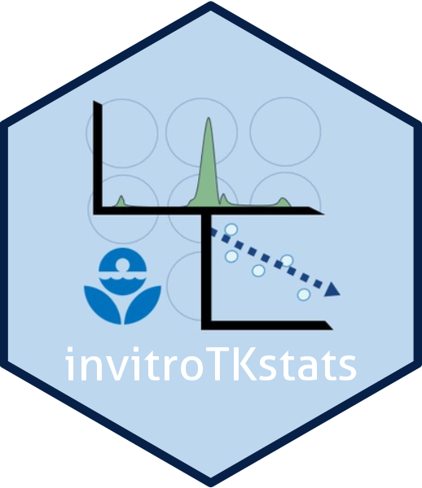

<!-- README.md is generated from README.Rmd. Please edit that file -->

```{r, include = FALSE}
knitr::opts_chunk$set(
  collapse = TRUE,
  comment = "#>",
  fig.path = "man/figures/README-",
  out.width = "100%"
)
```

# invitroTKstats

<!-- badges: start -->
<!-- badges: end -->

## Welcome to the GitHub repository for the invitroTKstats package

<a href="https://github.com/USEPA/invitroTKstats.git"></a>

The `invitroTKstats` R package contains functions to run a standardized data pipeline for processing high-throughput toxicokinetic (HTTK) mass-spectrometry data obtained from a variety of *in vitro* assays. The pipeline includes standardization for data documentation, statistical analyses predicting toxicokinetic parameters characterizing absorption, distribution, metabolism, and elimination of chemicals by the body.

The assays covered by the pipeline include intrinsic clearance after hepatocyte incubation ($Cl_{int}$); two variants of plasma protein binding experiments ($f_{up}$) -- namely Rapid Equilibrium Dialysis (RED) and Ultracentrifugation (UC), CACO-2 membrane permeability, and blood to plasma concentration ratio. Analysis methods include a frequentist point estimation and, in some cases, Bayesian estimations for the distribution of likely parameter values. Data used to derive the estimates are based on mass spectrometry ratios of analyte peak areas to internal standard (ISTD) peak areas.

If you are interested in contributing or want to report a bug, please submit an issue or start a discussion.

### Dependencies

* Users will need the freely available [R statistical computing language](https://www.r-project.org/).
* Users will need the freely available ["Just Another Gibbs Sampler" (JAGS)](https://mcmc-jags.sourceforge.io/).
* Users will need to have the following R packages installed in addition to `invitroTKstats`:
  * `ggplot2`
  * `parallel`
  * `runjags`
  * `stats4`
* Users will likely want a development environment like [RStudio](https://www.rstudio.com/products/rstudio/download/).

## Installation

* Installing the current version of the package from GitHub, run the following command in the R console:

```r
devtools::install_github("https://github.com/USEPA/invitroTKstats.git")
```

* Installing a local clone of the GitHub repo:

  1. Go to the GitHub repo for [`invitroTKstats`](https://github.com/USEPA/invitroTKstats.git).
  2. Choose the "Code" button and copy the repo URL.
  3. In your local command line terminal, navigate to the directory location you wish to store your local copy of the repo.
  4. In your terminal type `git clone https://github.com/USEPA/invitroTKstats.git`.
  5. After cloning completes then open an R session.
  6. In the R console use the following commands:
  
```r
devtools::install_local(
  "<file_path_to_invitroTKstats_repo>/invitroTKstats"
)
```

* Installing a tarball version of the package:

  1. Save the tarball file "invitroTKstats_X.Y.Z.tar.gz" to a local directory location.
  2. Install the package via the RStudio provided 'Install Packages' menu under the 'Tools' tab, or using the command line terminal with the following:
  
```
R CMD INSTALL <file_path_to_invitroTKstats_tarball>/invitroTKstats_X.Y.Z.tar.gz
```

*NOTE: "X.Y.Z" in the tarball filename indicates the version number associated with the version of the package you wish to install.* 

### Loading the Package

To load the `invitroTKstats` R package into your local R session via the R console:

```r
library(invitroTKstats)
```

Check the package version installed and in use:

```r
packageVersion(invitroTKstats)
```

## Contributors

* John Wambaugh (Package Creator, Conceptualization, Data Processing, & Subject Matter Expert)
* Sarah E. Davidson-Fritz (Conceptualization & Lead Package Developer)
* Lindsay Knupp (Software Development)
* Barbara A. Wetmore (Raw Data Generation & Subject Matter Expert)
* Nicolas Chantel (Initial Bayesian Model Development for $f_{up}$ RED assay)
* Zhihui Zhao (Software Development)
* Anna Kreutz (Raw Data Generation & Subject Matter Expert)

## Disclaimer

The United States Environmental Protection Agency (EPA) GitHub project code is provided on an "as is" basis and the user assumes responsibility for its use. EPA has relinquished control of the information and no longer has responsibility to protect the integrity, confidentiality, or availability of the information. Any reference to specific commercial products, processes, or services by service mark, trademark, manufacturer, or otherwise, does not constitute or imply their endorsement, recommendation or favoring by EPA. The EPA seal and logo shall not be used in any manner to imply endorsement of any commercial product or activity by EPA or the United States Government.
