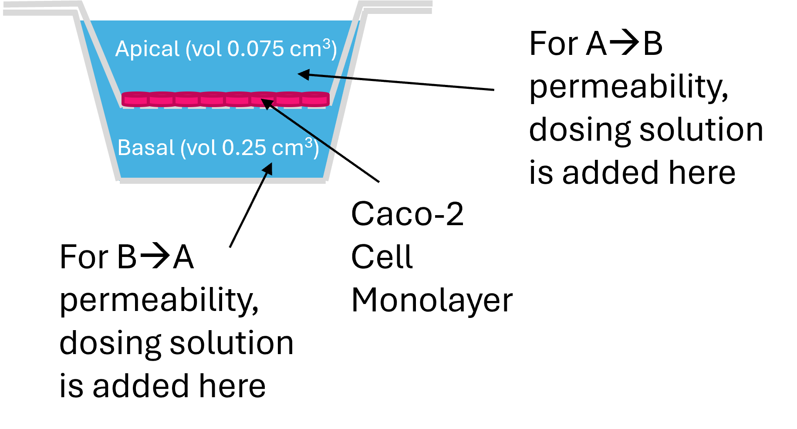

```{r, include = FALSE}
knitr::opts_chunk$set(
  collapse = TRUE
)
```

## Introduction 

This vignette guides users on how to estimate apparent membrane permeability (P~app~) from mass spectrometry data. Apparent membrane permeability is a chemical specific parameter that describes the general transport of the chemical through a membrane (Honda et al. 2024). 

The mass spectrometry data should be collected from a Caco-2 assay in which the test compound was added to either the apical or basolateral side of a confluent and differentiated Caco-2 cell monolayer as seen in Figure 1 (Honda et al. 2024). 

```{r, echo = FALSE, out.width = "60%", fig.cap = "Fig 1: Cl~int~ experimental set up", fig.topcaption = TRUE, fig.align = "center"}

```

### Suggested packages for use with this vignette 
```{r setup, message = FALSE}
# Primary package 
library(invitroTKstats)
# Data manipulation and plotting packages 
library(dplyr)
library(flextable)
```

## Load Data 

First, we load in the example dataset from invitroTKstats. 
```{r Load example data}
# Load example caco2 data 
data("Caco2-example")
```

Three datasets are loaded in: `caco2_L0`, `caco2_L1`, and `caco2_L2`. These datasets are Caco-2 data at Level 0, 1, and 2 respectively. For the purpose of this vignette, we'll start with `caco2_L0`, the Level 0 data, to demonstrate the complete pipelining process. 

`caco2_L0` is the output from the `merge_level0` function which compiles raw lab data from specified Excel files into a singular data frame. The data frame contains exactly one row per sample with information obtained from the mass spectrometer. For more details on curating raw lab data to a singular Level 0 data frame, see "Creating dataguide from raw data vignette". 

The following table displays the first three rows of `caco2_L0`, our Level 0 data.

```{r, echo = FALSE, tab = 1}
head(caco2_L0, n = 3) %>% 
  flextable() %>% 
  bg(bg = "#DDDDDD", part = "header") %>% 
  autofit() %>% 
  set_table_properties(
    opts_html = list(
      scroll = list(
        height = 200
      )
      )
  ) %>% 
  set_caption(caption = "Table 1: Level 0 data",
              align_with_table = FALSE) %>% 
  theme_vanilla
```

## Level 1 processing

`format_caco2` is the Level 1 function used to create a standardized data frame. This level of processing is necessary because naming conventions or formatting can differ across data sets. 

If the Level 0 data already contains the required column, then the existing column name can be specified. For example, `caco2_L0` already contains a column specifying the sample name called "Sample". However, the default column name for sample name is "Lab.Sample.Name". Therefore, we specify the correct column with `sample.col = "Sample"`. In general, to specify an already existing column that differs from the default, the user must use the parameter with the `.col` suffix. 

If the Level 0 data does not already contain the required column, then the column can be populated with a single value. For example, `caco2_L0` does not contain a column specifying biological replicates. Therefore, we populate the required column with `biological.replicates = 1`. In general, to specify a single value for an entire column, the user must use the  parameter without the `.col` suffix.

Users should be mindful if they choose to specify a single value for all of their samples and verify that that is the action they wish to take. 

Some columns must be present in the Level 0 data while others can be filled with a single value. At minimum, the following columns must be present in the Level 0 data and specified as single entry is not permitted: `sample.col`, `lab.compound.col`, `date.col`, `compound.col`, `area.col`, `istd.col`, `type.col`, `direction.col`, `receiver.vol.col`, `donor.vol.col`, and `note.col`, 

The rest of the following columns may either be specified from the Level 0 data or filled with a single value: `membrane.area.col` or `membrane.area`, `compound.conc.col` or `compound.conc`, `cal.col` or `cal`, `dilution.col` or `dilution`, `time.col` or `time`, `istd.name.col` or `istd.name`, `istd.conc.col` or `istd.conc`, `nominal.test.conc.col` or `nominal.test.conc`, `biological.replicates.col` or `biological.replicates`, `analysis.method.col` or `analysis.method`, `analysis.instrument.col` or `analysis.instrument`, `analysis.parameters.col` or `analysis.parameters`, `level0.file.col` or `level0.file`, and `level0.sheet.col` or `level0.sheet`.

```{r required cols, echo = FALSE}
# Create a table of required parameters for Level 1

req_cols <- data.frame(matrix(nrow = 33, ncol = 4))
vars <- c("Parameter", "Required in L0?", "Corresp. single-entry Parameter", "Descr.")
colnames(req_cols) <- vars

# Parameter names 
parameters <- c("FILENAME", "data.in", "sample.col", "lab.compound.col", "dtxsid.col", "date.col", 
                "compound.col", "area.col", "istd.col", "type.col", "direction.col", "membrane.area.col",
                "receiver.vol.col", "donor.vol.col", "compound.conc.col", "cal.col", "dilution.col",
                "time.col", "istd.name.col", "istd.conc.col", "nominal.test.conc.col", "biological.replicates.col",
                "technical.replicates.col", "analysis.method.col", "analysis.instrument.col", "analysis.parameters.col",
                "note.col", "level0.file.col", "level0.sheet.col", "output.res", "save.bad.types", "INPUT.DIR", "OUTPUT.DIR")
req_cols[, "Parameter"] <- parameters

# Parameter required in L0?
req_cols <- req_cols %>% 
  mutate("Required in L0?" = case_when(
    Parameter %in% c("sample.col", "lab.compound.col", "dtxsid.col", "date.col", "compound.col", "area.col", "istd.col", 
  "type.col", "direction.col", "receiver.vol.col", "donor.vol.col", "note.col") ~ "Y",
  Parameter %in% c("FILENAME", "data.in", "output.res", "save.bad.types", "sig.figs", "INPUT.DIR", "OUTPUT.DIR") ~ "N/A",
  .default = "N"
  ))

# Corresponding single-entry parameter 
req_cols <- req_cols %>% 
  mutate("Corresp. single-entry Parameter" = ifelse(.data[[vars[[2]]]] == "N", 
                                                    gsub(".col" ,"", Parameter), NA))

# Brief description 
description <- c("Output and/or input filename",
                 "Level 0 data frame", 
                 "Lab sample name", 
                 "Lab test compound name (abbr.)",
                 "EPA's DSSTox Structure ID",
                 "Lab measurement date",
                 "Formal test compound name",
                 "Target analyte peak area",
                 "Internal standard peak area",
                 "Sample type (Blank/D0/D2/R2)",
                 "Experiment direction",
                 "Membrane area",
                 "Receiver compartment volume",
                 "Donor compartment volume",
                 "Test chemical concentration",
                 "MS calibration",
                 "Number of times sample was diluted",
                 "Time before compartments were measured",
                 "Internal standard name",
                 "Internal standard concentration",
                 "Initial test chemical concentration added to donor",
                 "Replicates with the same analyte",
                 "Repeated measurements from one sample",
                 "Analytical chemistry analysis method",
                 "Analytical chemistry analysis instrument",
                 "Analytical chemistry analysis parameters",
                 "Additional notes",
                 "Raw data filename",
                 "Raw data sheet name",
                 "Export restuls (TSV)?",
                 "Export bad data (TSV)?",
                 "Input directory of Level 0 file",
                 "Export directory to save Level 1 files")
req_cols[, "Descr."] <- description

```

```{r, echo = FALSE}
req_cols %>% 
  flextable() %>% 
  bg(bg = "#DDDDDD", part = "header") %>% 
  autofit() %>% 
  set_table_properties(
    opts_html = list(
      scroll = list(height = 200)
      )
  ) %>% 
  set_caption("Table 2: Level 1 parameters", align_with_table = FALSE) %>% 
  theme_vanilla
```

By default, a TSV file containing the Level 1 data is exported to the user's directory. We have omitted this export with `output.res = FALSE`. The option to omit exporting a TSV file is also available at Levels 2 and 3 and will be used from this point forward. 

```{r L1 processing}
# Manually add note column
caco2_L0_curated <- caco2_L0 %>% 
  mutate(Note = "")

caco2_L1_curated <- format_caco2(FILENAME = "Caco2_vignette",
                                 data.in = caco2_L0_curated,
                                 # columns present in L0 data 
                                 sample.col = "Sample",
                                 lab.compound.col = "Lab.Compound.ID",
                                 compound.col = "Compound",
                                 area.col = "Peak.Area",
                                 istd.col = "ISTD.Peak.Area",
                                 compound.conc.col = "Compound.Conc",
                                 analysis.method.col = "Analysis.Params",
                                 # columns not present in L0 data
                                 biological.replicates = 1,
                                 membrane.area = 0.11,
                                 cal = 1,
                                 time = 2, 
                                 istd.conc = 1,
                                 nominal.test.conc = 10,
                                 analysis.instrument = "Agilent.GCMS",
                                 analysis.parameters = "Unknown",
                                 # don't export output TSV file
                                 output.res = FALSE
                                 )
```

All of our samples are successfully formatted and returned in `caco2_L1_curated`, the Level 1 data frame. Each sample had one of the following sample types: Blank with no chemical added (Blank), Dosing vehicle (C0) at target concentration (D0), Donor compartment at the end of the experiment (D2), or Receiver compartment at the end of the experiment (R2). If any of the samples did not have one of the appropriate sample types, it would be removed and reported to the user. If the user wanted to export the removed samples as a TSV, the user can set the parameter `save.bad.types = TRUE`.  

The following table displays the first three samples of `caco2_L1_curated` with a non-Blank sample type. In addition to the columns specified by the user, there is an additional column called `Response`. This column is the test compound concentration at the specified time and is calculated as $\textrm{Response} = \frac{\textrm{Analyte Area}}{\textrm{ISTD Area}}*\textrm{ISTD Conc}$. 

```{r, echo = FALSE}
# Select non-Blank sample type to display Response col 
caco2_L1_curated %>% 
  filter(!Sample.Type %in% c("Blank", "CC")) %>% 
head(n = 3) %>% 
  flextable() %>% 
  bg(bg = "#DDDDDD", part = "header") %>% 
  autofit() %>% 
  set_table_properties(
    opts_html = list(
      scroll = list(height = 200)
      )
  ) %>% 
  set_caption("Table 3: Level 1 data", align_with_table = FALSE) %>% 
  theme_vanilla
```

## Level 2 processing 

`sample_verification is the Level 2 function used to add a verification column. The verification column indicates whether a sample should be included in the point estimation (Level 3) processing. This column allows users to keep all samples in their data but only utilize the reliable samples for P~app~ estimation. All of the data in Level 2 is identical to the data in Level 1 with the exception of the additional `Verified` column. 

To determine whether a sample should be included, the user should consult the wet-lab scientists from where their data originates. This level of processing allows the user to receive feedback from the wet-lab scientists, exclude erroneous or unreliable samples, and produce new P~app~ estimates. There is an open channel of communication between the user and the wet-lab scientists. 

We will use the already processed Level 2 data frame, `caco2_L2`, to regenerate our exclusion data. Note, all of our samples are verified but we are explaining how to create an exclusion list for learning purposes. In general, the user would not have access to the exclusion information a priori.

The exclusion data frame must include the following columns: `Variables`, `Values`, and `Message`. The `Variables` column contains the variable names used to filter the excluded rows. Here, we are using `Lab.Sample.Name` and `DTXSID` to identify the excluded rows separated by a "|". The `Values` column contains the values of the variables, as a character, also separated by a "|". The `Message` column contains the reason for exclusion. Here, we are using the reasons listed in the `Verified` column in `caco2_L2`. 

```{r L2 processing exclusion}
# Use verification data from loaded in `caco2_L2` data frame 
exclusion <- caco2_L2 %>% 
  filter(Verified != "Y") %>% 
  mutate("Variables" = "Lab.Sample.Name|DTXSID") %>% 
  mutate("Values" = paste(Lab.Sample.Name, DTXSID, sep = "|")) %>% 
  mutate("Message" = Verified)
```

```{r, echo = FALSE }
exclusion %>% 
  flextable() %>% 
  bg(bg = "#DDDDDD", part = "header") %>% 
  autofit() %>% 
  set_table_properties(
    opts_html = list(
      scroll = list(height = 200)
      )
  ) %>% 
  set_caption("Table 4: Exclusion data", align_with_table = FALSE) %>% 
  theme_vanilla
```

As expected, our exclusion data frame is empty because all of our samples are verified. If all of the user's samples are verified, they simply do not provide an `exclusion.info` data frame in `sample_verification`. 

```{r}
caco2_L2_curated <- sample_verification(FILENAME = "Caco2_vignette",
                                        data.in = caco2_L1_curated,
                                        assay = "Caco-2",
                                        # don't export output TSV file
                                        output.res = FALSE)
```

Our Level 2 data now contains a 'Verified' column. If the sample should be included, the column contains a "Y" for yes. If the sample should be excluded, the column contains the reason for exclusion. 

The following table displays some rows of the Level 2 data. 

```{r, echo = FALSE}
caco2_L2_curated %>% 
  head(n = 3) %>% 
  flextable() %>% 
  bg(bg = "#DDDDDD", part = "header") %>% 
  autofit() %>% 
  set_table_properties(
    opts_html = list(
      scroll = list(height = 200)
      )
  ) %>% 
  set_caption("Table 5: Level 2 data", align_with_table = FALSE) %>% 
  theme_vanilla
```

## Level 3 processing 

`calc_caco2_point` is the Level 3 function used to calculate the P~app~ point estimate for each test compound. 

Mathematically, P~app~ is the amount of compound transported per unit time and is defined as $\frac{dQ/dt}{c_0*A}$ where $dQ/dt$ is the rate of permeation, $c_0$ is the initial concentration in the donor compartment, and $A$ is the surface area of the cell monolayer. 

First, the rate of permeation can be understood as the amount of compound passing through the monolayer per unit time. Therefore, it can be expressed as 
$$c_{\textrm{receiver}}$$

First, flux can be understood as the amount of compound passing through the monolayer with units of $\mu$mol/s  

## References 

Honda, Gregory S., et al. "Impact of gut permeability on estimation of oral bioavailability for chemicals in commerce and the environment." ALTEX-Alternatives to animal experimentation (2024).

Hubatsch I, Ragnarsson EG, Artursson P (2007). “Determination of drug permeability and prediction of drug absorption in Caco-2 monolayers.” Nature protocols, 2(9), 2111–2119.


