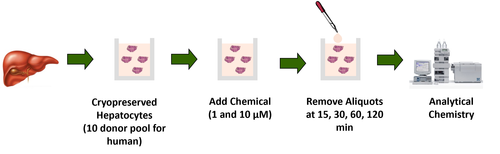

```{r, include = FALSE}
knitr::opts_chunk$set(
  collapse = TRUE,
  comment = "#>",
  fig.align = 'center'
)
```

## Introduction 

This vignette guides users on how to estimate intrinsic hepatic clearance (Cl~int~) from mass spectrometry data. Intrinsic hepatic clearance is a chemical specific parameter that describes a liver's ability to metabolize an unbound compound. It is characterized by the disappearance of compound when incubated with primary hepatocytes (Breen et al. 2021). 

The mass spectrometry data should be collected from an assay that uses cryopreserved hepatocyte suspension (Shibata et al. 2002) as seen in Figure 1. 

```{r, echo = FALSE, out.width = "100%", fig.cap = "Fig 1: Cl~int~ experimental set up", fig.topcaption = TRUE, fig.align = "center"}

```

### Suggested packages for use with this vignette 

```{r setup, message = FALSE, warning = FALSE}
# Primary package 
library(invitroTKstats)
# Data manipulation package 
library(dplyr)
# Table formatting package 
library(flextable)
```

## Load Data

First, we load in the example dataset from `invitroTKstats`. 

```{r Load example data}
# Load example clint data 
data("Clint-example")
```

Many datasets are loaded in: `clint_L0`, `clint_L1`,`clint_L2`, `clint_L3`, and `clint_L4`. These datasets are Cl~int~ data at Level 0, 1, 2, 3, and 4 respectively. Additional datasets associated with Level 4 processing are also loaded in: `clint_L2_heldout` and `clint_PREJAGS`. These will be described later in the "Level 4 processing" section.
Lastly, a `clint_cheminfo` dataset is loaded in that contains chemical information necessary for identification mapping; it is used to create Level 0 data. For the purpose of this vignette, we'll start with `clint_L0`, the Level 0 data, to demonstrate the complete pipelining process. 

`clint_L0` is the output from the `merge_level0` function which compiles raw lab data from specified Excel files into a singular data frame. The data frame contains exactly one row per sample with information obtained from the mass spectrometer. For more details on curating raw lab data to a singular Level 0 data frame, see the "Data Guide Creation and Level-0 Data Compilation" vignette. 

The following table displays the first three rows of `clint_L0`, our Level 0 data.  

```{r, echo = FALSE, warning = FALSE}
head(clint_L0, n = 3) %>% 
  flextable() %>% 
  bg(bg = "#DDDDDD", part = "header") %>% 
  autofit() %>% 
  set_table_properties(
    opts_html = list(
      scroll = list(
      )
      )
  ) %>% 
  set_caption(caption = "Table 1: Level 0 data",
              align_with_table = FALSE) %>% 
  fontsize(size = 10, part = "all") %>% 
  theme_vanilla()
```

## Level 1 processing

`format_clint` is the Level 1 function used to create a standardized data frame. This level of processing is necessary because naming conventions or formatting can differ across data sets. 

If the Level 0 data already contains the required column, then the existing column name can be specified. For example, `clint_L0` already contains a column specifying the sample name called "Sample". However, the default column name for sample name is "Lab.Sample.Name". Therefore, we specify the correct column with `sample.col = "Sample"`. In general, to specify an already existing column that differs from the default, the user must use the parameter with the `.col` suffix. 

If the Level 0 data does not already contain the required column, then the entire column can be populated with a single value. For example, `clint_L0` does not contain a column specifying biological replicates. Therefore, we populate the required column with `biological.replicates = 1`. In general, to specify a single value for an entire column, the user must use the parameter without the `.col` suffix. 

Users should be mindful if they choose to specify a single value for all of their samples; they should verify this action is one they wish to take. 

Some columns must be present in the Level 0 data while others can be filled with a single value. At minimum, the following columns must be present in the Level 0 data and specification with a single entry is not permitted: `sample.col`, `compound.col`, `dtxsid.col`, `lab.compound.col`, `type.col`, `istd.col`, and `area.col`. 

If there is no additional `note.col` in the Level 0 data, users should use `note.col = NULL` to fill the column with "Note". 

The rest of the following columns may either be specified from the Level 0 data or filled with a single value: `date.col` or `date`, `density.col` or `density`, `cal.col` or `cal`, `dilution.col` or `dilution`, `time.col` or `time`, `istd.name.col` or `istd.name`, `istd.conc.col` or `istd.conc`, `test.conc.col` or `test.conc`, `test.nominal.conc.col` or `test.nominal.conc`, `biological.replicates.col` or `biological.replicates`, `analysis.method.col` or `analysis.method`, `analysis.instrument.col` or `analysis.instrument`, `analysis.parameters.col` or `analysis.parameters`, `level0.file.col` or `level0.file`, and `level0.sheet.col` or `level0.sheet`. 

```{r required cols, echo = FALSE}
# Create table of required parameters for Level 1 

req_cols = data.frame(matrix(nrow = 31, ncol = 5))
vars <- c("Argument", "Default", "Required in L0?", "Corresp. single-entry Argument", "Descr.")
colnames(req_cols) <- vars

# Argument names 
arguments <- c("FILENAME", "data.in", "sample.col", "date.col", "compound.col",
                "dtxsid.col", "lab.compound.col", "type.col", "density.col", 
                "cal.col", "dilution.col", "time.col", "istd.col", "istd.name.col", 
                "istd.conc.col", "test.conc.col", "test.nominal.conc.col",
                "area.col", "biological.replicates.col", "technical.replicates.col",
                "analysis.method.col", "analysis.instrument.col",
                "analysis.parameters.col", "note.col", "level0.file.col", 
                "level0.sheet.col", "output.res", "save.bad.types", "sig.figs", "INPUT.DIR",
                "OUTPUT.DIR")
req_cols[,"Argument"] <- arguments

# Default arguments 
defaults <- c("MYDATA", NA, "Lab.Sample.Name", "Date", "Compound.Name",
              "DTXSID", "Lab.Compound.Name", "Sample.Type", "Hep.Density", 
              "Cal", "Dilution.Factor", "Time", "ISTD.Area", "ISTD.Name", "ISTD.Conc", 
              "Test.Compound.Conc", "Test.Target.Conc", "Area", 
              "Biological.Replicates", "Technical.Replicates", "Analysis.Method", 
              "Analysis.Instrument", "Analysis.Parameters", "Note", 
              "Level0.File", "Level0.Sheet", "TRUE", "FALSE", 5, NA, NA)
req_cols[,"Default"] <- defaults

# Argument required in L0?
req_cols <- req_cols %>% 
  mutate("Required in L0?" = case_when(
    Argument %in% c("sample.col","compound.col", "dtxsid.col", "lab.compound.col", "type.col", "istd.col", "area.col") ~ "Y",
    Argument %in% c("FILENAME", "data.in", "output.res", "save.bad.types", "sig.figs", "INPUT.DIR", "OUTPUT.DIR") ~ "N/A", 
    .default = "N"
  ))

# Corresponding single-entry Argument 
req_cols <- req_cols %>% 
  mutate("Corresp. single-entry Argument" = ifelse(.data[[vars[[3]]]] == "N" & .data[[vars[[1]]]] != "note.col", gsub(".col","",Argument),
                NA))

# Brief description 
description <- c("Output and input filename", 
                 "Level 0 data frame", 
                 "Lab sample name",
                 "Lab measurement date",
                 "Formal test compound name",
                 "EPA's DSSTox Structure ID",
                 "Lab test compound name (abbr.)",
                 "Sample type (Blank/Cvst/Inactive/CC)",
                 "Hepatocyte density in the in vitro incubation",
                 "MS calibration",
                 "Number of times sample was diluted",
                 "Time since chemical was introduced",
                 "Internal standard peak area",
                 "Internal standard name", 
                 "Internal standard concentration",
                 "Standard test chemical concentration",
                 "Initial chemical concentration",
                 "Target analyte peak area",
                 "Replicates with the same analyte", 
                 "Repeated measurements from one sample", 
                 "Analytical chemistry analysis method",
                 "Analytical chemistry analysis instrument",
                 "Analytical chemistry analysis parameters", 
                 "Additional notes", 
                 "Raw data filename", 
                 "Raw data sheet name", 
                 "Export results (TSV)?",
                 "Export bad data (TSV)?",
                 "Number of significant figures",
                 "Input directory of Level 0 file",
                 "Export directory to save Level 1 files"
                 )


req_cols[,"Descr."] <- description
```

```{r, echo = FALSE, warning = FALSE}
req_cols %>% 
  flextable() %>% 
  bg(bg = "#DDDDDD", part = "header") %>% 
  autofit() %>% 
  set_table_properties(
    opts_html = list(
      scroll = list(
        height = 200
      )
      )
  ) %>% 
  set_caption(caption = "Table 2: Level 1 'format_clint' function arguments",
              align_with_table = FALSE) %>% 
  fontsize(size = 10, part = "all") %>% 
  theme_vanilla()
```

By default, a TSV file containing the Level 1 data is exported to the user's directory. We have omitted this export with `output.res = FALSE`. The option to omit exporting a TSV file is also available at Levels 2 and 3 and will be used from this point forward.

```{r L1 processing} 
clint_L1_curated <- format_clint(FILENAME = "Clint_vignette", 
                         data.in = clint_L0,
                         # columns present in L0 data 
                         sample.col = "Sample",
                         compound.col = "Compound",
                         lab.compound.col = "Lab.Compound.ID",
                         type.col = "Type",
                         istd.col = "ISTD.Peak.Area",
                         area.col = "Peak.Area",
                         note.col = "Sample Text",
                         test.conc.col = "Compound.Conc",
                         analysis.parameters.col = "Analysis.Params",
                         # columns not present in L0 data
                         density = 0.5,
                         test.nominal.conc = 1,
                         analysis.instrument = "Unknown",
                         analysis.method = "LCMS",
                         istd.conc = 0.01,
                         cal = 1,
                         biological.replicates = 1,
                         # don't export output TSV file
                         output.res = FALSE
                         )
```

We receive a warning message that some of our samples have been removed due to "inappropriate sample types". The removed samples include data that did not have one of the following sample types

1. Blank with no chemical added (Blank)
2. Hepatocyte incubation concentration (Cvst)
3. Inactivated Hepatocytes (Inactive)
4. Calibration Curve (CC)

The following table displays some of the samples that were removed. These samples are annotated with a "QC" sample type indicating "Quality Control" and should therefore not be included in our analysis.

```{r, echo = FALSE}
clint_L0 %>% 
  filter(Type == "QC") %>% 
  head(n = 5) %>% 
  flextable() %>% 
  bg(bg = "#DDDDDD", part = "header") %>% 
  autofit() %>% 
  set_table_properties(
    opts_html = list(
      scroll = list(
        height = 200
      )
      )
  ) %>% 
  set_caption(caption = "Table 3: Subset of removed samples",
              align_with_table = FALSE) %>% 
  fontsize(size = 10, part = "all") %>% 
  theme_vanilla()
```

Users can verify that these samples are excluded by filtering their Level 1 data frame and ensuring no matches are found. One approach is given below.  

```{r, eval = FALSE}
# All the samples of an inappropriate sample type 
excluded <- clint_L0 %>% 
  filter(!Type %in% c("Blank", "Cvst", "Inactive", "CC"))

# Exclude based on Sample and DTXSID
X <-  c(excluded$Sample)
names(X) <- paste(excluded$Sample, excluded$DTXSID, sep = "+")
Y <- c(excluded$DTXSID)

# Find samples in L1 data frame with matching sample name (X) and DTXSID (Y)
matches <- as.data.frame(t(mapply(function(X,Y) 
  {subset(clint_L1_curated, Lab.Sample.Name == X & DTXSID == Y)},
       X, Y, USE.NAMES = T)))

matches

# Check that no matches were returned for each sample in `excluded`
check <-  rep(1,nrow(matches))
names(check) <- rownames(matches)
for (name in rownames(matches)) {
  # If no matches were found, each element of check should evaluate to 0
  check[name] <- sum(sapply(c(1:ncol(matches)),
                           function(X) {length(matches[1,X][[1]])}))
}

# Verify that each sample in `excluded` had no matches
check 

# If no matches, should evaluate to 0
sum(check)
```

To export the removed samples types as a TSV, the user can set the parameter `save.bad.types = TRUE`. For this example, we will not save the discarded sample types.

The following table displays the first three rows of `clint_L1_curated`, our Level 1 data produced from `format_clint`. In addition to the columns specified by the user, there is an additional column called `Response`. This column is the test compound concentration and is calculated as $\textrm{Response} = \frac{\textrm{Analyte Area}}{\textrm{ISTD Area}}*\textrm{ISTD Conc}$ where $\textrm{Analyte Area}$ is defined by the `Area` column, $\textrm{ISTD Area}$ is defined by the `ISTD.Area` column, and $\textrm{ISTD Conc}$ is defined by the `ISTD.Conc` column. 

```{r, echo = FALSE, warning = FALSE}
clint_L1_curated %>% 
  head(n = 3) %>% 
  flextable() %>% 
  bg(bg = "#DDDDDD", part = "header") %>% 
  autofit() %>% 
  set_table_properties(
    opts_html = list(
      scroll = list(
      )
      )
  ) %>% 
  set_caption(caption = "Table 4: Level 1 data",
              align_with_table = FALSE) %>% 
  fontsize(size = 10, part = "all") %>% 
  theme_vanilla()
```

## Level 2 processing

`sample_verification` is the Level 2 function used to add a verification column. The verification column indicates whether a sample should be included in the point estimation (Level 3) and credible interval (Level 4) processing. This column allows users to keep all samples in their data but only utilize the reliable samples for Cl~int~ estimation. All of the data in Level 2 is identical to the data in Level 1 with the exception of the additional `Verified` column. 

To determine whether a sample should be included, the user should consult the wet-lab scientists from where their data originates or a chemist who may be able to provide reliable rationale for samples that should not be verified. This level of processing allows the user to receive feedback from the wet-lab scientists, exclude erroneous or unreliable samples, and produce new Cl~int~ estimates. Thus, there is always an open channel of communication between the user and the wet-lab scientists or chemists.

We will use the already processed Level 2 data frame, `clint_L2`, to regenerate our exclusion data. In general, the user would not have access to the exclusion information *a priori*. 

The exclusion data frame must include the following columns: `Variables`, `Values`, and `Message`. The `Variables` column contains the variable names used to filter the excluded rows. Here, we are using `Lab.Sample.Name` and `DTXSID` to identify the excluded rows separated by a "|". The `Values` column contains the values of the variables, as a character, also separated by a "|". The `Message` column contains the reason for exclusion. Here, we are using the reasons listed in the `Verified` column in `clint_L2`. The user should refrain from using "|" in any of their descriptions to avoid conflicts with the `sample_verification` function. 

```{r L2 processing exclusion}
# Use verification data from loaded in `clint_L2` data frame
exclusion <- clint_L2 %>% 
  filter(Verified %in% c("Wrong Mix", "Unknown Conc.")) %>% 
  mutate("Variables" = "Lab.Sample.Name|DTXSID") %>% 
  mutate("Values" = paste(Lab.Sample.Name, DTXSID, sep = "|")) %>% 
  mutate("Message" = Verified) %>% 
  select(Variables, Values, Message)
```

```{r, echo = FALSE, warning = FALSE}
exclusion %>% 
  flextable() %>% 
  bg(bg = "#DDDDDD", part = "header") %>% 
  autofit() %>% 
  set_table_properties(
    opts_html = list(
      scroll = list(
        height = 200
      )
      )
  ) %>% 
  set_caption(caption = "Table 5: Exclusion data frame",
              align_with_table = FALSE) %>% 
  fontsize(size = 10, part = "all") %>% 
  theme_vanilla()
```

```{r L2 processing}
clint_L2_curated <- sample_verification(FILENAME = "Clint_vignette",
                                     data.in = clint_L1_curated,
                                     assay = "Clint",
                                     exclusion.info = exclusion,
                                     # don't export output TSV file 
                                     output.res = FALSE)
```

Our Level 2 data now contains a `Verified` column. If the sample should be included, the column contains a "Y" for yes. If the sample should be excluded, the column contains the reason for exclusion. 

The following table displays some rows of the Level 2 data, each with a different value in the `Verification` column. Note, the reasons for exclusion are not limited to "Unknown Conc." or "Wrong Mix", they were merely provided as an example.

```{r, echo = FALSE, warning = FALSE}
df1 <- head(clint_L2_curated, n = 1)
df2 <- head(filter(clint_L2_curated, Verified == "Wrong Mix"), n = 1)
df3 <- head(filter(clint_L2_curated, Verified == "Unknown Conc."), n = 1)

temp <- rbind(df1, df2)
temp <- rbind(temp, df3)
```


```{r, echo = FALSE, warning = FALSE}
temp %>% 
  flextable() %>% 
  bg(bg = "#DDDDDD", part = "header") %>% 
  autofit() %>% 
  set_table_properties(
    opts_html = list(
      scroll = list(
      )
      )
  ) %>% 
  set_caption(caption = "Table 6: Level 2 data",
              align_with_table = FALSE) %>% 
  fontsize(size = 10, part = "all") %>% 
  theme_vanilla()
```

## Level 3 processing

`calc_clint_point` is the Level 3 function used to calculate the Cl~int~ point estimate for each test compound using a Frequentist framework. 

Mathematically, Cl~int~ is the slope of the line representing log concentrations over time. With some assumptions on the form of the line and on the distribution of the error terms, we can estimate Cl~int~ using maximum likelihood estimation.  

First, we assume the test compound concentration at time $t$ is an exponential decay model $$C(t) = \textrm{cal}*C_0*e^{-mt}$$ where $\textrm{cal}$ is the MS calibration, $C_0$ is the test compound concentration at time 0, $m$ is the rate constant, and $t$ is the incubation time. Notice that if a natural log is applied, $$\textrm{ln}(C(t)) = -mt + \textrm{ln}(\textrm{cal}*C_0)$$ $m$ is the slope of the line representing log concentrations over time. Thus, the rate constant $m$ is our Cl~int~ value. 

Next, we also assume the random noise is normally distributed $\varepsilon_i \sim \mathcal{N}(0,\sigma^2)$ where $\sigma^2$ is unknown. 

Lastly, the test compound concentration, our dependent variable, is qualitatively defined by our `Response` column, the ratio of the analyte area to the ISTD area. 

With this information, we can rewrite our dependent variable as $$y_i \sim \mathcal{N}(C(t),\sigma^2)$$ After some simplification, our log-likelihood is defined as $$l(\theta) = N*log\left(\frac{1}{\sqrt{2\pi}\sigma}\right)-\frac{1}{2}\sum_{i=1}^N\frac{(y_i-C(\theta, t))^2}{\sigma^2}$$ where $\theta = (\textrm{cal}, m)$ and $N$ is the number of Cvst and Blank samples. 

Using the `mle` estimator in the `stats4` package, we then estimate the parameters that maximize the log-likelihood for each test compound. 

```{r L3 processing}
clint_L3_curated <- calc_clint_point(FILENAME = "Clint_vignette",
                             data.in = clint_L2_curated,
                             # don't export output TSV file
                             output.res = FALSE)
```

Our Level 3 data contains a `Clint` estimate, `Clint.pValue`, `AIC` of the exponential decay fit, and `AIC.Null` of the exponential decay assuming a constant rate of decay. 

Some experiments also include the assay performed at 1 $\mu M$ and 10 $\mu M$ to check for the saturation of metabolizing enzymes. The test compound concentration at time $t$ with a saturation probability is assumed to follow an exponential decay model with a slight modification $$C_{sat}(t) = \textrm{cal}*C_0*e^{-m*\textrm{sat}*t}$$ where $\textrm{cal}$ is the MS calibration, $C_0$ is the test compound concentration at time 0, $m$ is the rate constant, $t$ is the incubation time, and $\textrm{sat}$ is the probability of saturation, or the probability of observing a lower clearance rate at a higher concentration. 

If these samples are included, `Clint.1` is the clearance rate at 1 $\mu M$, `Clint.10` is the clearance rate at 10 $\mu M$, `AIC.Sat` is the AIC of the exponential decay with a saturation probability, and `Sat.pValue` is the corresponding p-value.

Because our example data did not include these samples, `Clint.1`, `Clint.10`, `AIC.Sat`, and `Sat.pValue` are empty. 

```{r, echo = FALSE}
clint_L3_curated %>% 
  flextable() %>% 
  bg(bg = "#DDDDDD", part = "header") %>% 
  autofit() %>% 
  set_table_properties(
    opts_html = list(
      scroll = list(
      )
      )
  ) %>% 
  set_caption(caption = "Table 7: Level 3 data",
              align_with_table = FALSE) %>% 
  fontsize(size = 10, part = "all") %>% 
  theme_vanilla()
```

## Level 4 processing

`calc_clint` is the Level 4 function used to calculate Cl~int~ point estimates and credible intervals using a Bayesian framework. Markov chain Monte Carlo (MCMC) simulations are used to randomly sample from the posterior distribution with a uniform prior. 

To run Level 4, one needs to have JAGS installed on their machine. To determine the correct path, the user must use `runjags::findjags()` as their argument for the `JAGS.PATH` parameter. 

We pass `clint_L2_curated`, the Level 2 data frame, and **not** `clint_L3_curated`, the Level 3 data frame, into `calc_clint`. This is because Level 3 and Level 4 processing are not sequential; they are methods that calculate different statistical quantities. The following code chunk takes a while to run; previous runtimes are around 7 minutes.     

```{r L4 Processing, message= FALSE, eval = FALSE}
clint_L4_curated <- calc_clint(FILENAME = "Clint_vignette",
                       data.in = clint_L2_curated, 
                       JAGS.PATH = runjags::findjags()
                       )
```

```{r, echo = FALSE}
clint_L4_curated <- clint_L4
```

The Cl~int~ intervals are returned to the user's R session, in an exported TSV file, and in an exported RData file. There is no parameter to prevent the TSV or RData files from being exported because of the potential for the simulations to crash. If there are no crashes, then the exported TSV file is identical to the user's R session and the exported RData file. `clint_L4` is an example exported RData file. 

Additionally, intermediate files are saved to the user's current working directory if `TEMP.DIR = NULL`. These include a Level 2 heldout set, `clint_L2_heldout`, containing unverified samples and a Level 4 PREJAGS list, `clint_PREJAGS`, containing arguments provided to JAGS. Because the PREJAGS list is overwritten with each compound, `clint_PREJAGS` only contains information relevant to the last tested compound, TFMFPA in this case.

Our Level 4 data contains a Cl~int~ credible interval and the corresponding p-value for each chemical.

```{r, echo = FALSE}
clint_L4_curated %>% 
  flextable() %>% 
  bg(bg = "#DDDDDD", part = "header") %>% 
  autofit() %>% 
  set_table_properties(
    opts_html = list(
      scroll = list(
      )
      )
  ) %>% 
  set_caption(caption = "Table 8: Level 4 data",
              align_with_table = FALSE) %>% 
  fontsize(size = 10, part = "all") %>% 
  theme_vanilla()
```


## Best Practices: Food for thought 

Generally, data processing pipelines should include minimal to no manual coding. It is best to keep clean code that is easily reproducible and transferable. The user should aim to have all the required data and meta-data files properly formatted to avoid further modifications throughout the pipeline. 

## References 

Breen, M., Ring, C. L., Kreutz, A., Goldsmith, M. R., & Wambaugh, J. F. (2021). High-throughput PBTK models for in vitro to in vivo extrapolation. Expert opinion on drug metabolism & toxicology, 17(8), 903-921.

Shibata, Y., Takahashi, H., Chiba, M., & Ishii, Y. (2002). Prediction of hepatic clearance and availability by cryopreserved human hepatocytes: an application of serum incubation method. Drug Metabolism and disposition, 30(8), 892-896.
