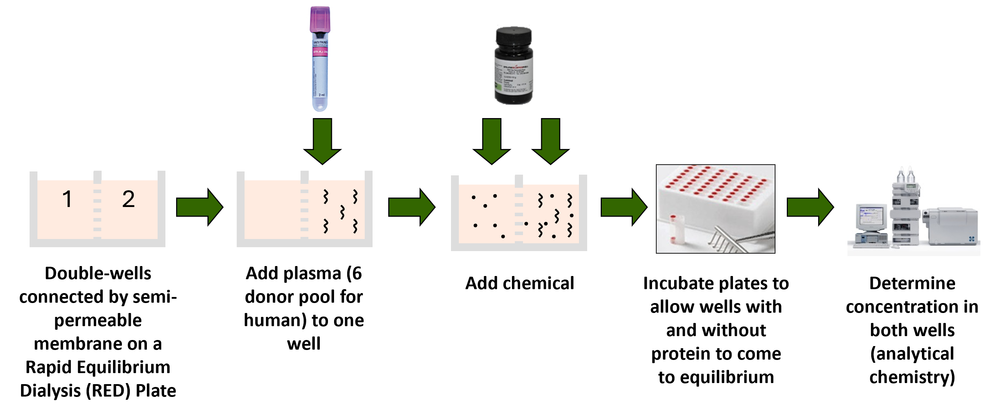

```{r, include = FALSE}
knitr::opts_chunk$set(
  collapse = TRUE,
  comment = "#>",
  fig.align = 'center'
)
```

## Introduction {#intro}

This vignette guides users on how to estimate fraction unbound in plasma (f~up~) from mass spectrometry data using rapid equilibrium dialysis (RED). Fraction unbound in plasma is a chemical specific parameter that describes the amount of free chemical in the plasma that is usually responsible for pharmacological effects (@waters2008validation).

The mass spectrometry data should be collected from an assay that uses rapid equilibrium dialysis as seen in Figure 1 (@waters2008validation). 

```{r, echo = FALSE, out.width = "100%", fig.cap = "Fig 1: f~up~ RED experimental set up", fig.topcaption = TRUE, fig.align = "center"}

```

### Suggested packages for use with this vignette {#rpckgs}

```{r setup, message = FALSE, warning = FALSE}
# Primary package
library(invitroTKstats)
# Data manipulation package
library(dplyr)
# Table formatting package 
library(flextable)
```

## Load Data {#data}

First, we load in the example dataset from `invitroTKstats`. 

```{r Load example data}
# Load example fup RED data 
data("fup-red-example")
```

Many datasets are loaded in: `fup_red_L0`, `fup_red_L1`, `fup_red_L2`, `fup_red_L3`, and `fup_red_L4`. These datasets are f~up~ data at Level 0, 1, 2, 3, and 4 respectively. Additional datasets associated with Level 4 processing are also loaded in: `fup_red_L2_heldout` and `fup_red_PREJAGS`. These will be described later in the "Level 4 processing" section. Lastly, a `fup_red_cheminfo` dataset is loaded in that contains chemical information necessary for identification mapping; it is used to create Level 0 data. For the purpose of this vignette, we'll start with `fup_red_L0`, the Level 0 data, to demonstrate the complete pipelining process.

`fup_red_L0` is the output from the `merge_level0` function which compiles raw lab data from specified Excel files into a singular data frame. The data frame contains exactly one row per sample with information obtained from the mass spectrometer. For more details on curating raw lab data to a singular Level 0 data frame, see the "Data Guide Creation and Level-0 Data Compilation" vignette.

The following table displays the first three rows of `fup_red_L0`, our Level 0 data. 

```{r, echo = FALSE, warning = FALSE}
head(fup_red_L0, n = 3) %>% 
  flextable() %>% 
  bg(bg = "#DDDDDD", part = "header") %>% 
  autofit() %>% 
  set_table_properties(
    opts_html = list(
      scroll = list(
        
      )
    )
  ) %>% 
  set_caption(caption = "Table 1: Level 0 data", 
              align_with_table = FALSE) %>% 
  fontsize(size = 10, part = "all") %>% 
  theme_vanilla()
```

## Level 1 processing {#level1} 

`format_fup_red` is the Level 1 function used to create a standardized data frame. This level of processing is necessary because naming conventions or formatting can differ across data sets. 

If the Level 0 data already contains the required column, then the existing column name can be specified. For example, `fup_red_L0` already contains a column specifying the sample name called "Sample". However, the default column name for sample name is "Lab.Sample.Name". Therefore, we specify the correct column with `sample.col = "Sample"`. In general, to specify an already existing column that differs from the default, the user must use the parameter with the `.col` suffix. 

If the Level 0 data does not already contain the required column, then the entire column can be populated with a single value. For example, `fup_red_L0` does not contain a column specifying biological replicates. Therefore, we populate the required column with `biological.replicates = 1`. In general, to specify a single value for an entire column, the user must use the parameter without the `.col` suffix. 

Users should be mindful if they choose to specify a single value for all of their samples; they should verify this action is one they wish to take. 

Some columns must be present in the Level 0 data while others can be filled with a single value. At minimum, the following columns must be present in the Level 0 data and specification with a single entry is not permitted: `sample.col`, `compound.col`, `dtxsid.col`, `lab.compound.col`, `type.col`, `istd.col`, and  `area.col`. 

If there is no additional `note.col` in the Level 0 data, users should use `note.col = NULL` to fill the column with "Note".

The rest of the following columns may either be specified from the Level 0 data or filled with a single value: `date.col` or `date`, `cal.col` or `cal`, `dilution.col` or `dilution`, `time.col` or `time`, `istd.name.col` or `istd.name`, `istd.conc.col` or `istd.conc`, `test.nominal.conc.col` or `test.nominal.conc`, `plasma.percent.col` or `plasma.percent`, `test.conc.col` or `test.conc`, `biological.replicates.col` or `biological.replicates`, `technical.replicates.col` or `technical.replicates`, `analysis.method.col` or `analysis.method`, `analysis.instrument.col` or `analysis.instrument`, `analysis.parameters.col` or `analysis.parameters`, `level0.file.col` or `level0.file`, and `level0.sheet.col` or `level0.sheet`. 

```{r required cols, echo = FALSE}
# Create table of required arguments for Level 1 

req_cols <- data.frame(matrix(nrow = 31, ncol = 5))
vars <- c("Argument", "Default", "Required in L0?", "Corresp. single-entry Argument", "Descr.")
colnames(req_cols) <- vars

# Argument names 
arguments <- c("FILENAME", "data.in", "sample.col", "date.col", "compound.col", "dtxsid.col", 
               "lab.compound.col", "type.col", "cal.col", "dilution.col", "time.col", 
               "istd.col", "istd.name.col", "istd.conc.col", "test.nominal.conc.col", 
               "plasma.percent.col", "test.conc.col", "area.col",
               "biological.replicates.col", "technical.replicates.col",
               "analysis.method.col", "analysis.instrument.col", 
               "analysis.parameters.col", "note.col", "level0.file.col", 
               "level0.sheet.col", "output.res", "save.bad.types", "sig.figs", 
               "INPUT.DIR", "OUTPUT.DIR")
req_cols[,"Argument"] <- arguments 

# Default arguments 
defaults <- c("MYDATA", NA, "Lab.Sample.Name", "Date", "Compound.Name", "DTXSID",
              "Lab.Compound.Name", "Sample.Type", "Cal", "Dilution.Factor", 
              "Time", "ISTD.Area", "ISTD.Name", "ISTD.Conc", "Test.Target.Conc", 
              "Plasma.Percent", "Test.Compound.Conc", "Area", "Biological.Replicates", 
              "Technical.Replicates", "Analysis.Method", "Analysis.Instrument", 
              "Analysis.Parameters", "Note", "Level0.File", "Level0.Sheet", 
              FALSE, FALSE, 5, NA, NA)
req_cols[,"Default"] <- defaults

# Argument required in L0? 
req_cols <- req_cols %>% 
  mutate("Required in L0?" = case_when(
    Argument %in% c("sample.col", "compound.col", "dtxsid.col", "lab.compound.col", 
                    "type.col", "istd.col", "area.col") ~ "Y",
    Argument %in% c("FILENAME", "data.in", "output.res", "save.bad.types", "sig.figs", 
                    "INPUT.DIR", "OUTPUT.DIR") ~ "N/A",
    .default = "N"
  ))

# Corresponding single-entry Argument 
req_cols <- req_cols %>% 
  mutate("Corresp. single-entry Argument" = ifelse(.data[[vars[3]]] == "N" & .data[[vars[[1]]]] != "note.col",
                                                   gsub(".col", "", Argument), NA))

# Brief description 
description <- c("Output and input filename",
                 "Level 0 data frame", 
                 "Lab sample name", 
                 "Lab measurement date", 
                 "Formal test compound name", 
                 "EPA's DSSTox Structure ID", 
                 "Lab test compound name (abbr.)", 
                 "Sample type (Blank/Plasma/PBS/T0/Stability/EC_acceptor/EC_donor/CC)",
                 "MS calibration", 
                 "Number of times sample was diluted",
                 "Incubation time", 
                 "Internal standard peak area", 
                 "Internal standard name", 
                 "Internal standard concentration", 
                 "Initial chemical concentration",
                 "% of the physiological plasma concentration",
                 "Standard test chemical concentration",
                 "Target analyte peak area", 
                 "Replicates with the same analyte", 
                 "Repeated measurements from one sample",
                 "Analytical chemistry analysis method",
                 "Analytical chemistry analysis instrument", 
                 "Analytical chemistry analysis parameters", 
                 "Additional notes", 
                 "Raw data filename", 
                 "Raw data sheet name", 
                 "Export results (TSV)?",
                 "Export bad data (TSV)?",
                 "Number of significant figures", 
                 "Input directory of Level 0 file", 
                 "Export directory to save Level 1 files")
req_cols[,"Descr."] <- description
```

```{r, echo = FALSE, warning = FALSE}
req_cols %>% 
  flextable() %>% 
  bg(bg = "#DDDDDD", part = "header") %>% 
  autofit() %>% 
  set_table_properties(
    opts_html = list(
      scroll = list(
        height = 200
      )
    )
  ) %>% 
  set_caption(caption = "Table 2: Level 1 `format_fup_red` function arguments", align_with_table = FALSE) %>% 
  fontsize(size = 10, part = "all") %>% 
  theme_vanilla()
```

A TSV file containing the level-1 data can be exported to the user's per-session temporary directory. This temporary directory is a per-session directory whose path can be found with the following code: `tempdir()`. For more details, see 
[https://www.collinberke.com/til/posts/2023-10-24-temp-directories/].

To avoid exporting to this temporary directory, an `OUTPUT.DIR` must be specified. We have omitted this export entirely with `output.res = FALSE` (the default). The option to omit exporting a TSV file is also available at levels 2 and 3 and will be used from this point forward. 

```{r L1 processing}
fup_red_L1_curated <- format_fup_red(FILENAME = "Fup_RED_vignette",
                                     data.in = fup_red_L0, 
                                     # columns present in L0 data 
                                     sample.col = "Sample",
                                     compound.col = "Compound", 
                                     lab.compound.col = "Lab.Compound.ID",
                                     istd.col = "ISTD.Peak.Area", 
                                     test.conc.col = "Compound.Conc",
                                     area.col = "Peak.Area",
                                     technical.replicates.col = "Replicate",
                                     note.col = NULL,
                                     # columns not present in L0 data
                                     cal = 1, 
                                     istd.conc = 0.01, 
                                     test.nominal.conc = 10,
                                     plasma.percent = 100,
                                     biological.replicates = 1,
                                     analysis.method = "LCMS",
                                     analysis.instrument = "Waters ACQUITY I-Class UHPLC - Xevo TQ-S uTQMS",
                                     analysis.parameters = "RT",
                                     # don't export output TSV file 
                                     output.res = FALSE
                                     )
```

We receive a warning message that some of our samples have been removed due to "inappropriate sample types". The removed samples include data that did not have one of the following sample types 

1. Blank with plasma (Plasma.Blank)
3. Blank without plasma (NoPlasma.Blank)
2. Plasma well concentration (Plasma)
3. Phosphate-buffered well concentration (PBS)
4. Time zero plasma concentration (T0)
5. Plasma stability sample (Stability)
6. Acceptor Equilibrium Control Well (EC_acceptor)
7. Donor Equilibrium Control Well (chemical spiked side) (EC_donor)
8. Calibration Curve (CC)

The following table displays some of the samples that were removed. These samples are annotated with a "QC" sample type indicating "Quality Control" and should therefore not be included in our analysis.  

```{r, echo = FALSE}
fup_red_L0 %>% 
  filter(!Sample.Type %in% c("Plasma", "PBS", "T0", "Plasma.Blank", "NoPlasma.Blank","CC", "Stability", "EC_donor", "EC_acceptor")) %>% 
  head(n = 5) %>% 
  flextable() %>% 
  bg(bg = "#DDDDDD", part = "header") %>%
  autofit() %>%
  set_table_properties(
    opts_html = list(
      scroll = list(
        height = 200
      )
    )
  ) %>% 
  set_caption(caption = "Table 3: Subset of removed samples",
              align_with_table = FALSE) %>% 
  fontsize(size = 10, part = "all") %>% 
  theme_vanilla()
```

Users can verify that these samples are excluded by filtering their Level 1 data frame and ensuring no matches are found. One approach is given below. 

```{r, eval = FALSE}
# All the samples of an inappropriate sample type 
excluded <- fup_red_L0 %>% 
  filter(!Sample.Type %in% c("Plasma", "PBS", "T0", "Plasma.Blank", "NoPlasma.Blank","CC", "Stability", "EC_acceptor", "EC_donor"))

# Exclude based on Sample and DTXSID 
X <- c(excluded$Sample)
names(X) <- paste(excluded$Sample, excluded$DTXSID, sep = "+")
Y <- c(excluded$DTXSID)

# Find samples in L1 data frame with matching sample name (X) and DTXSID (Y) 
matches <- as.data.frame(t(mapply(function(X,Y)
  {subset(fup_red_L1_curated, Lab.Sample.Name == X & DTXSID == Y)},
  X, Y, USE.NAMES = T)))

matches

# Check that no matches were returned for each sample in `excluded`
check <- rep(1, nrow(matches))
names(check) <- rownames(matches)
for (name in rownames(matches)){
  # If no matches were found, each element of check should evaluate to 0
  check[name] <- sum(sapply(c(1:ncol(matches)),
                            function(X){length(matches[1,X][[1]])}))
}

# Verify that each sample in `excluded` had no matches 
check

# If no matches, should evaluate to 0
sum(check)
```

To export the removed samples as a TSV, the user can set the parameter `save.bad.types = TRUE`. For this example, we will not save the discarded sample types. 

The following table displays the first three rows of `fup_red_L1_curated`, our Level 1 data produced from `format_fup_red`. In addition to the columns specified by the user, there is an additional column called `Response`. This column is the test compound concentration and is calculated as $\textrm{Response} = \frac{\textrm{Analyte Area    }}{\textrm{ISTD Area}} *\textrm{ISTD Conc}$ where $\textrm{Analyte Area}$ is defined by the `Area` column, $\textrm{ISTD Area}$ is defined by the `ISTD.Area` column, and $\textrm{ISTD Conc}$ is defined by the `ISTD.Conc` column. 

```{r, echo = FALSE}
fup_red_L1_curated %>% 
  head(n = 3) %>% 
  flextable() %>% 
  bg(bg = "#DDDDDD", part = "header") %>% 
  autofit() %>% 
  set_table_properties(
    opts_html = list(
      scroll = list(
      )
    )
  ) %>% 
  set_caption(caption = "Table 4: Level 1 data", 
              align_with_table = FALSE) %>% 
  fontsize(size = 10, part = "all") %>% 
  theme_vanilla()
```

## Level 2 processing {#level2}

`sample_verification` is the Level 2 function used to add a verification column. The verification column indicates whether a sample should be included in the point estimation (Level 3) and credible interval (Level 4) processing. This column allows users to keep all samples in their data but only utilize the reliable samples for f~up~ estimation. All of the data in Level 2 is identical to the data in Level 1 with the exception of the additional `Verified` column. 

To determine whether a sample should be included, the user should consult the wet-lab scientists from where their data originates or a chemist who may be able to provide reliable rationale for samples that should not be verified. This level of processing allows the user to receive feedback from the wet-lab scientists, exclude erroneous or unreliable samples, and produce new f~up~ estimates. Thus, there is always an open channel of communication between the user and the wet-lab scientists or chemists. 

We will use the already processed Level 2 data frame, `fup_red_L2`, to regenerate our exclusion data. Note, all of our samples are verified but we are explaining how to create an exclusion list for learning purposes. In general, the user would not have access to the exclusion information *a priori*. 

The exclusion data frame must include the following columns: `Variables`, `Values`, and `Message`. The `Variables` column contains the variable names used to filter the excluded rows. Here, we are using `Lab.Sample.Name` and `DTXSID` to identify the excluded rows separated by a "|". The `Values` column contains the values of the variables, as a character, also separated by a "|". The `Message` column contains the reason for exclusion. Here, we are using the reasons listed in the `Verified` column in `fup_red_L2`. The user should refrain from using "|" in any of their descriptions to avoid conflicts with the `sample_verification` function. 

```{r L2 processing exclusion}
# Use verification data from loaded in `fup_red_L2` data frame 
exclusion <- fup_red_L2 %>% 
  filter(Verified != "Y") %>% 
  mutate("Variables" = "Lab.Sample.Name|DTXSID") %>% 
  mutate("Values" = paste(Lab.Sample.Name, DTXSID, sep = "|")) %>% 
  mutate("Message" = Verified) %>% 
  select(Variables, Values, Message)
```

```{r, echo = FALSE}
exclusion %>% 
  flextable() %>% 
  bg(bg = "#DDDDDD", part = "header") %>% 
  autofit() %>% 
  set_table_properties(
    opts_html = list(
      scroll = list(
        height = 200
      )
      )
  ) %>% 
  set_caption(caption = "Table 5: Exclusion data frame",
              align_with_table = FALSE) %>% 
  fontsize(size = 10, part = "all") %>% 
  theme_vanilla()
```

As expected, our exclusion data frame is empty because all of our samples are verified. If all of the user's samples are verified, they simply do not provide an `exclusion.info` data frame in `sample_verification`. 

```{r}
fup_red_L2_curated <- sample_verification(FILENAME = "Fup_RED_vignette",
                                          data.in = fup_red_L1_curated,
                                          assay = "fup-RED",
                                          # don't export output TSV file
                                          output.res = FALSE)
```

Our Level 2 data now contains a `Verified` column. If the sample should be included, the column contains a "Y" for yes. If the sample should be excluded, the column contains the reason for exclusion. 

The following table displays some rows of the Level 2 data. 

```{r, echo = FALSE}
fup_red_L2_curated %>% 
  head(n = 3) %>% 
  flextable() %>% 
  bg(bg = "#DDDDDD", part = "header") %>% 
  autofit() %>% 
  set_table_properties(
    opts_html = list(
      scroll = list()
      )
  ) %>% 
  set_caption("Table 6: Level 2 data", align_with_table = FALSE) %>% 
  fontsize(size = 10, part = "body") %>% 
  theme_vanilla()
```

## Level 3 processing {#level3}

`calc_fup_red` is the Level 3 function used to calculate the f~up~ point estimate from rapid equilibrium dialysis for each test compound using a Frequentist framework. 

Mathematically, f~up~ is the ratio of the compound concentration in the buffer well to the plasma well. However, in some experiments, the phosphate buffered solution (PBS) is loaded into both sides of the chamber; the difference between the wells is then differentiated by the well which is spiked with the chemical - the side containing the plasma. Therefore, to improve clarity, we rename the "plasma well" as the "donor well" and the "buffer well" as the "receiver well" such that $$f_{up} = \frac{C_{\textrm{receiver}}}{C_{\textrm{donor}}}$$ where $C_{\textrm{receiver}}$ is the compound concentration in the receiver well and $C_{\textrm{donor}}$ is the compound concentration in the donor well. 

The concentrations are defined as the mean PBS or Plasma response multiplied by its dilution factor. To account for background noise, we also subtract the mean NoPlasma.Blank or Plasma.Blank responses respectively. 

```{r}
fup_red_L3_curated <- calc_fup_red_point(FILENAME = "Fup_RED_vignette",
                                         data.in = fup_red_L2_curated, 
                                         # don't export output TSV file
                                         output.res = FALSE)
```

```{r, echo = FALSE}
fup_red_L3_curated %>% 
  flextable() %>% 
  bg(bg = "#DDDDDD", part = "header") %>% 
  autofit() %>% 
  set_caption("Table 7: Level 3 data", align_with_table = FALSE) %>% 
  fontsize(size = 10, part = "body") %>% 
  theme_vanilla()
```

Our Level 3 data contains a `Fup` estimate and a `Calibration` column that details which data was used to calculate the point estimate. 

## Level 4 processing {#level4}

`calc_fup_red` is the Level 4 function used to calculate f~up~ point estimates and credible intervals from rapid equilibrium dialysis using a Bayesian framework. Markov chain Monte Carlo (MCMC) simulations are used to randomly sample from the posterior distribution with a uniform prior. 

To run Level 4, one needs to have JAGS installed on their machine. To determine the correct path, the user must use `runjags::findjags()` as their argument for the `JAGS.PATH` parameter. 

We pass `fup_red_L2_curated`, the Level 2 data frame, and **not** `fup_red_L3_curated`, the Level 3 data frame, into `calc_fup_red`. This is because Level 3 and Level 4 processing are not sequential; they are methods that calculate different statistical quantities. The following code chunk takes a while to run; previous runtimes are around 8 minutes.   

```{r L4 processing, message = FALSE, eval = FALSE}
fup_red_L4_curated <- calc_fup_red(FILENAME = "Fup_RED_vignette",
                                   data.in = fup_red_L2_curated,
                                   JAGS.PATH = runjags::findjags()
                                   )
```

```{r, echo = FALSE}
fup_red_L4_curated <- fup_red_L4
```

The f~up~ intervals are returned to the user's R session, in an exported TSV file, and in an exported RData file. There is no parameter to prevent the TSV or RData files from being exported because of the potential for the simulations to crash. If there are no crashes, then the exported TSV file is identical to the user's R session and the exported RData file. `fup_red_L4` is an example exported RData file. 

Additionally, intermediate files are saved to the user's current working directory if `TEMP.DIR = NULL`. These include a Level 2 heldout set, `fup_red_L2_heldout`, containing unverified samples and a Level 4 PREJAGS list, `fup_red_PREJAGS`, containing arguments provided to JAGS. Because the PREJAGS list is overwritten with each compound, `fup_red_PREJAGS` only contains information relevant to the last tested compound, PFOA in this case.

Our Level 4 data contains a f~up~ credible interval.

```{r, echo = FALSE, eval = TRUE}
fup_red_L4_curated %>% 
  flextable() %>% 
  bg(bg = "#DDDDDD", part = "header") %>% 
  autofit() %>% 
  set_table_properties(
    opts_html = list(
      scroll = list(
      )
      )
  ) %>% 
  set_caption(caption = "Table 8: Level 4 data",
              align_with_table = FALSE) %>% 
  fontsize(size = 10, part = "all") %>% 
  theme_vanilla()
```

## Best Practices: Food for thought {#bestpractice}

Generally, data processing pipelines should include minimal to no manual coding. It is best to keep clean code that is easily reproducible and transferable. The user should aim to have all the required data and meta-data files properly formatted to avoid further modifications throughout the pipeline. 

## Appendix {#appendix}

### L4 Bayesian Modeling Information {#level4_eqns}

In this section, we provide the equations for the Bayesian model (i.e., priors and likelihoods) used to estimate the fraction unbound in plasma ($f_{up}$), from the rapid equilibrium dialysis (RED) assay, and the uncertainty about that estimate.  The following sub-sections are organized such that:

* Each section contains the relevant hyper-parameters and their priors followed by the variable likelihoods
* Sections are ordered from the most fundamental variables/parameters (i.e. those used in later equations) to the likelihood for the observations used to estimate the fraction unbound in plasma ($f_{up}$)

Some of the indices are reused between sections (e.g. $i$, $w^*_i$, etc.).  However, it should be noted that these are not meant to be understood across sub-sections; rather, only understood within the context of the section they are in.

*NOTE: Readers unfamiliar with JAGS should be aware that JAGS software uses precision ($\tau$) rather than variance $\sigma^2$ (i.e., $\tau = \frac{1}{\sigma^2}$).*

#### Measurement Model {#hyperpriors}

Each chemical may have more than one day of experimentation, and thus multiple calibrations.  Suppose for the chemical of interest there are a total of $n_{cal}$ calibrations (`Num.cal`).  For a particular calibration $w \in (1,\ldots,n_{cal})$ we assume the following hyper-priors for our Bayesian model:

**Prior for log-scale constant analytic standard deviation (`log.const.analytic.sd`):**

$$ log(\sigma_a)_w \sim \textrm{Unif} \left( a = -6,b = 1 \right) ; \space \sigma_{a,w} = 10^{log(\sigma_a)_w} $$

where $a$ and $b$ are the minimum and maximum, respectively, and $\sigma_{a,w}$ is the converted parameter used in later equations (`const.analytic.sd`).

**Prior for the log-scale heteroscedastic analytic slope (`log.hetero.analytic.slope`):**

$$ log(m_h)_w \sim \textrm{Unif} \left( a = -6,b = 1 \right) ; \space m_{h,w} = 10^{log(m_h)_w} $$

where $a$ and $b$ are the minimum and maximum, respectively, and $m_{h,w}$ is the converted parameter used in later equations (`hetero.analytic.slope`).

**Prior for the threshold concentration (`C.thresh`):**

$$ C_{thresh,w} \sim \textrm{Unif} \left( a = 0,b = \frac{conc_{target,w}}{10} \right) $$

where $a$ and $b$ are the minimum and maximum, respectively, and $conc_{target,w}$ is the expected initial concentration (`Test.Nominal.Conc`) for calibration index $w$.

**Prior for the log-scale calibration (`log.calibration`):**

$$ log(cal)_w \sim \textrm{N} \left( \mu = 0,\tau = 0.01 \right) ; \space cal_w = 10^{log(cal)_w} $$

where $\mu$ and $\tau$ are the mean and precision, respectively, and $cal_w$ is the converted parameter used in later equations (`calibration`).

**Prior for the background (`background`):**

$$ \gamma_w \sim \textrm{Exp} \left( \lambda = 100 \right) $$

where $\lambda$ is the rate parameter.

#### Estimation for Blanks with No Plasma {#llnpb}

Suppose $n_{NPB}$ is the total number of blank observations without plasma (`Num.NoPlasma.Blank.obs`), and $y_{NPB,i}$ is the $i^{th}$ no plasma blank observation, sample type = "NoPlasma.Blank" (`NoPlasma.Blank.obs`). For each observation we obtain a posterior MCMC estimate for the observations with:

Estimation of predictions for blanks with no plasma (`NoPlasma.Blank.pred`):

$$ x_{NPB,i} = \frac{\gamma_{w^*_i}}{df_{NPB}} $$

where

* $df_{NPB}$ is the dilution factor for the no plasma blank observations (`NoPlasma.Blank.df`)
* $w^*_i$ represents the calibration index (`NoPlasma.Blank.cal`) for the $i^{th}$ observation $w^* = (w^*_1,\ldots,w^*_{n_{NPB}})$ and $w^*_i \in w$ (i.e. $w^*_i$ indicates one of the $n_{cal}$ calibrations)

Estimation of precision for blanks with no plasma (`NoPlasma.Blank.prec`):

$$ \tau_{NPB,i} = \frac{1}{(\sigma_{a,w^*_i}+m_{h,w^*_i}*x_{NPB,i})^2} $$

**Likelihood for no plasma blank observations (`NoPlasma.Blank.obs`):**

$$ y_{NPB,i} \sim \textrm{N} \left( \mu = x_{NPB,i},\tau = \tau_{NPB,i} \right) $$

#### Estimation for Blanks with Plasma {#llblanks}

**Prior for estimating the extent of plasma interference (`log.Plasma.Interference`):**

$$ log(\eta_{plasma}) \sim \textrm{Unif} \left( a = -6,b = log_{10} \left( \frac{10}{conc_{target}} \right) \right); \space \eta_{plasma} = 10^{log(\eta_{plasma})} $$

where $a$ and $b$ are the minimum and maximum, respectively, $conc_{target}$ is the expected initial concentration (`Test.Nominal.Conc`), and $\eta_{plasma}$ is the converted parameter used in later equations (`log.Plasma.Interference`).

*NOTE: In the JAGS code $log_{10} \left( \frac{10}{conc_{target}} \right)$ is coded using the logarithmic "change of base" rule (i.e. $log_b(x) = \frac{log_a(x)}{log_a(b)}$ ).*

Suppose $n_{PB}$ is the total number of blank observations with plasma (`Num.Plasma.Blank.obs`), and $y_{PB,i}$ indicates the $i^{th}$ plasma blank observation, sample type = "Plasma.Blank" (`Plasma.Blank.obs`). For each observation we obtain a posterior MCMC estimate for the plasma blank observations with the following:

Estimation of predictions for blanks with plasma (`Plasma.Blank.pred`):

$$ x_{PB,i} = \frac{cal_{w^*_i} * (\frac{\eta_{plasma}*p_{protein,r^*_i}}{100} - C_{thresh,w^*_i}) * \beta_{PB,i}+\gamma_{w^*_i}}{df_{PB}} $$

where

* $df_{PB}$ is the dilution factor for blank observations with plasma (`Plasma.Blank.df`) 
* $p_{protein,r^*_i}$ is the percent of the physiological plasma concentration for the $i^{th}$ plasma blank observation, given the replicate index
* $r^*_i$ is the replicate index for the $i^{th}$ blank observation with plasma (`Plasma.Blank.rep`), such that $r^* = (r^*_1,\ldots,r^*_{n_{PB}})$
* $\beta_{PB,i}$ is the JAGS step function for the $i^{th}$ blank observation with plasma, such that

$$\beta_{PB,i} = 
\begin{cases}
1 & \textrm{if} \space (\frac{\eta_{plasma}*p_{protein,r^*_i}}{100} - C_{thresh,w^*_i}) \ge 0 \\
0 & \textrm{otherwise}
\end{cases}
$$

* $w^*_i$ is the calibration index for the $i^{th}$ blank observation with plasma (`Plasma.Blank.cal`), such that $w^* = (w^*_1, \ldots , w^*_{n_{PB}})$ and $w^*_i \in w$ (i.e. $w^*_i$ indicates one of the $n_{cal}$ calibrations).

Estimation of precision for blanks with plasma (`Plasma.Blank.prec`):

$$ \tau_{PB,i} = \frac{1}{(\sigma_{a,w^*_i}+m_{h,w^*_i}*x_{PB,i})^2} $$

**Likelihood for the plasma blank observations (`Plasma.Blank.obs`):**

$$ y_{PB,i} \sim \textrm{N} \left( \mu = x_{PB,i},\tau = \tau_{PB,i} \right) $$

#### Estimation for Initial Time (T0) {#llt0}

Suppose $n_{T0}$ is the total number of initial time observations (`Num.T0.obs`), and $y_{T0,i}$ indicates the $i^{th}$ T0 observation, sample type = "T0" (`T0.obs`). For each observation we obtain a posterior MCMC estimate for the initial time observations with the following:

Estimation of predictions for the T0 observations (`T0.pred`):

$$ x_{T0,i} = \frac{cal_{w^*_i}*(conc_{target}-\eta_{plasma}-C_{thresh,w^*_i})*\beta_{T0,i}+cal_{w^*_i}*\eta_{plasma}+\gamma_{w^*_i}}{df_{T0}} $$

where

* $df_{T0}$ is the dilution factor for T0 observations (`T0.df`)
* $\beta_{T0,i}$ is the JAGS step function for the $i^{th}$ T0 observation, such that 

$$ \beta_{T0,i} = 
\begin{cases}
1 & \textrm{if} \space (conc_{target}-\eta_{plasma}-C_{thresh,w^*_i}) \ge 0 \\
0 & \textrm{otherwise} 
\end{cases}
$$ 

* $w^*_i$ is the calibration index for the $i^{th}$ T0 observation (`T0.cal`), such that $w^* = (w^*_1, \ldots , w^*_{n_{T0}})$ and $w^*_i \in w$ (i.e. $w^*_i$ indicates one of the $n_{cal}$ calibrations).

*Assumes the MS responses are a function of the diluted expected initial concentration.*

Estimation of heteroscedastic precision for the T0 observations (`T0.prec`):

$$ \tau_{T0,i} = \frac{1}{(\sigma_{a,w^*_i} + m_{h,w^*_i}*x_{T0,i})^2} $$

**Likelihood for the T0 observations (`T0.obs`):**

$$ y_{T0,i} \sim \textrm{N} \left( \mu = x_{T0,i},\tau = \tau_{T0,i} \right) $$

#### Estimation for the Calibration Curve {#llcc}

Suppose $n_{CC}$ is the total number of calibration curve observations (`Num.CC.obs`), and $y_{CC,i}$ is the $i^{th}$ calibration curve observation, sample type = "CC" (`CC.obs`). For each observation we obtain a posterior MCMC estimate for the calibration curve observations with the following:

Estimation of the predictions for calibration curve observations (`CC.pred`):

$$
x_{CC,i} = \frac{cal_{w^*_i}*(C_{CC,i} - \eta_{plasma} - C_{thresh,w^*_i})*\beta_{CC,i}+cal_{w^*_i}*\eta_{plasma} + \gamma_{w^*_i}}{df_{CC}}
$$

where

* $C_{CC,i}$ is the standard test chemical concentration for the $i^{th}$ calibration curve observation
* $df_{CC}$ is the dilution factor for calibration curve observations (`CC.df`)
* $\beta_{CC,i}$ is the JAGS step function for the $i^{th}$ calibration curve observation, such that

$$ \beta_{CC,i} =
\begin{cases}
1 & \textrm{if} \space (C_{CC,i} - \eta_{plasma} - C_{thresh,w^*_i}) \ge 0 \\
0 & \textrm{otherwise}
\end{cases}
$$

* $w^*_i$ is the calibration index for the $i^{th}$ calibration curve observation (`CC.cal`), such that $w^* = (w^*_1, \ldots , w^*_{n_{CC}})$ and $w^*_i \in w$ (i.e. $w^*_i$ indicates one of the $n_{cal}$ calibrations).

*Assumes the MS responses are a function of the diluted expected initial concentration.*

Estimation of heteroscedastic precision for calibration curve observations (`CC.prec`):

$$
\tau_{CC,i} = \frac{1}{(\sigma_{a,w^*_i} + m_{h,w^*_i} * x_{CC,i})^2}
$$

**Likelihood of the calibration curve observations (`CC.obs`):**

$$ y_{CC,i} \sim \textrm{N} \left( \mu = x_{CC,i},\tau = \tau_{CC,i} \right) $$

#### Estimation for the RED Plasma Protein Binding Assay {#llredppb}

**Prior for the log-scale equilibrium constant (`log.Kd`):**

$$ log(K_d) \sim \textrm{Unif} \left( a = -10,b = 5 \right) ; \space K_d = 10^{log(K_d)} $$

where $a$ and $b$ are the minimum and maximum, respectively, and $K_d$ is the converted parameter used in later equations (`Kd`).

Estimation of the fraction unbound in plasma (`Fup`):

$$ f_{up} = \frac{K_d}{K_d + \rho_{protein}} $$

where $\rho_{protein}$ is the assumed physiological protein concentration available for plasma protein binding (`Physiological.Protein.Conc`).

##### Concentrations for Replicates

Suppose $n_{r}$ is the total number of replicate groups (`Num.rep`), i.e. calibration and technical replicate pairs for "PBS" and "Plasma" sample types, and $i$ indicates the replicate index (i.e. $i \in (1,\ldots,n_r)$). For each replicate a posterior MCMC estimate of concentrations are estimated as follows:

Estimation for the protein concentration for an observation (`C.protein`):

$$ C_{protein,i} = \frac{\rho_{protein}*p_{protein,i}}{100}  $$

where $\rho_{protein}$ is the assumed physiological protein concentration available for plasma protein binding and $p_{protein,i}$ is the percent of the physiological plasma concentration for the $i^{th}$ replicate group.

Estimation for the missing chemical in the assay system via binding to walls of the test system or cellular membranes (`C.missing`):

$$ C_{missing,i} \sim \textrm{Unif} \left( a = 0,b = conc_{target} \right) $$ 

where $a$ and $b$ are the minimum and maximum, respectively, and $conc_{target}$ is the expected initial concentration (`Test.Nominal.Conc`).

Estimation for the concentration of the chemical unbound in both wells (`C.u`):

$$ C_{u,i} = (conc_{target}-C_{missing,i}) * \frac{K_d}{2*K_d+C_{protein,i}} $$

Estimation for the concentration of the chemical bound in the plasma well (`C.b`):

$$ C_{b,i} = \frac{(conc_{target}-C_{missing,i})*C_{protein,i}}{2*K_d+C_{protein,i}} $$

Estimation for the total chemical concentration in the plasma well (`C.total`):

$$ C_{total,i} = C_{b,i} + C_{u,i} $$

#### Estimation for PBS {#llpbs}

Suppose $n_{PBS}$ is the total number of phosphate-buffered saline (PBS) observations (`Num.PBS.obs`), and $y_{PBS,i}$ is the $i^{th}$ PBS observation, sample type = "PBS" (`PBS.obs`). For each observation we obtain a posterior MCMC estimate for the observations with:

Estimation of the chemical concentration for the $i^{th}$ PBS observation ($C_{PBS,i}$, `PBS.conc`), assuming the unbound chemical concentration for the corresponding replicate index ($C_{u,r^*_i}$):

$$ C_{PBS,i} = C_{u,r^*_i} $$

where $r^*_i$ is the replicate index for the $i^{th}$ PBS observation (`PBS.rep`), such that $r^* = (r^*_1,\ldots,r^*_{n_{PBS}})$.

Estimation of the predictions for the PBS observations (`PBS.pred`):

$$
x_{PBS,i} = \frac{cal_{w^*_i}*(C_{PBS,i} - C_{thresh,w^*_i})*\beta_{PBS,i}+\gamma_{w^*_i}}{df_{PBS}}
$$

where

* $df_{PBS}$ is the dilution factor for PBS observations (`PBS.df`)
* $\beta_{PBS,i}$ is the JAGS step function for the $i^{th}$ PBS observation, such that

$$ \beta_{PBS,i} =
\begin{cases}
1 & \textrm{if} \space (C_{PBS,i} - C_{thresh,w^*_i}) \ge 0\space \\
0 & \textrm{otherwise}
\end{cases}
$$

* $w^*_i$ is the calibration index for the $i^{th}$ PBS observation (`PBS.cal`), such that $w^* = (w^*_1, \ldots , w^*_{n_{PBS}})$ and $w^*_i \in w$ (i.e. $w^*_i$ indicates one of the $n_{cal}$ calibrations).

*Assumes the MS responses are a function of the diluted expected initial concentration.*

Estimation of heteroscedastic precision for the PBS observation (`PBS.prec`):

$$
\tau_{PBS,i} = \frac{1}{(\sigma_{a,w^*_i} + m_{h,w^*_i} * x_{PBS,i})^2}
$$

**Likelihood of the PBS observations (`PBS.obs`):**

$$ y_{PBS,i} \sim \textrm{N} \left( \mu = x_{PBS,i},\tau = \tau_{PBS,i} \right) $$

#### Estimation for Plasma {#llplasma}

Suppose $n_{plasma}$ is the total number of plasma observations (`Num.Plasma.obs`), and $y_{plasma,i}$ is the $i^{th}$ plasma observation, sample type = "Plasma" (`Plasma.obs`). For each observation we obtain a posterior MCMC estimate for the plasma observations with the following:

Estimation of the plasma concentration ($C_{plasma,i}$, `Plasma.conc`), assuming the total concentration for the corresponding replicate index ($C_{total,r^*_i}$):

$$ C_{plasma} = C_{total,r^*_i} $$

where $r^*_i$ is the replicate index for the $i^{th}$ plasma observation (`Plasma.rep`), such that $r^* = (r*_1,\ldots,r^*_{n_{plasma}})$.

Estimation for the plasma predictions (`Plasma.pred`):

$$
x_{plasma,i} = \frac{cal_{w^*_i}*(C_{plasma,i} - \frac{\eta_{plasma}*p_{protein,r^*_i}}{100} - C_{thresh,w^*_i})*\beta_{plasma,i} + cal_{w^*_i} * \frac{\eta_{plasma}*p_{protein,r^*_i}}{100} + \gamma_{w^*_i}}{df_{plasma}}
$$

where

* $df_{plasma}$ is the dilution factor for plasma observations (`Plasma.df`)
* $p_{protein,r^*_i}$ is the percent of the physiological plasma concentration for the $i^{th}$ plasma observation, given the replicate index
* $\beta_{plasma,i}$ is the JAGS step function for the $i^{th}$ plasma observation, such that

$$
\beta_{plasma,i} = 
\begin{cases}
1 & \textrm{if} \space (C_{plasma,i} - \frac{\eta_{plasma}*p_{protein,r^*_i}}{100} - C_{thresh,w^*_i}) \ge 0 \\
0 & \textrm{otherwise}
\end{cases}
$$

* $w^*_i$ is the calibration index for the $i^{th}$ plasma observation (`Plasma.cal`), such that $w^* = (w^*_1,\ldots,w^*_{n_{plasma}})$ and $w^*_i \in w$ (i.e. $w^*_i$ indicates one fo the $n_{cal}$ calibrations).

*Assumes the MS responses are a function of the diluted expected initial concentration.*

Estimation for heteroscedastic precision of the plasma predictions (`Plasma.prec`):

$$ \tau_{plasma,i} = \frac{1}{(\sigma_{a,w^*_i} + m_{h,w^*_i} * x_{plasma,i})^2} $$

**Likelihood for the plasma observations (`Plasma.obs`):**

$$ y_{plasma,i} \sim \textrm{N} \left(\mu = x_{plasma,i},\tau = \tau_{plasma,i} \right) $$

### Post-MCMC Estimates {#postmcmc}

#### Fraction of Chemical Unbound in Plasma (Bayesian Estimates)

Posterior estimates for the chemical fraction unbound in plasma, including the median (`Fup.Med`) and $95\%$ credible interval (`Fup.Low` and `Fup.High`):

$$ \textrm{Fup.Med} = f_{up,0.5} $$

$$ \textrm{Fup.CI} = \left( \textrm{Fup.Low}, \textrm{Fup.High} \right) = \left( f_{up,0.025}, f_{up,0.975} \right)$$

where $f_{up,p}$ indicates the percentile ($p$) for the posterior distribution of the fraction of the chemical unbound in plasma, ($p = 0.5$ indicates the $50\%$ percentile, i.e. median, for the posterior distribution).

#### Fraction Unbound in Plasma (Empirical Point Estimate)

Point estimate for the chemical fraction unbound in plasma (`Fup.point`):

Suppose there are a total of $n_{PBS}$ observed phosphate buffered solution responses (`PBS`), then estimate the mean response

$$ \hat{\mu_{PBS}} = df_{PBS} * \frac{\sum_{j=1}^{n_{PBS}}(y_{PBS,j})}{n_{PBS}} $$
where $y_{PBS,j}$ is the $j^{th}$ PBS observation and $df_{PBS}$ is the dilution fraction for PBS observations, sample type = `PBS`.

Suppose there are a total of $n_{NPB}$ observed blank observations with no plasma (`NoPlasma.Blank`), then estimate the mean response

$$ \hat{\mu_{NPB}} = df_{NPB} * \frac{\sum_{j = 1}^{n_{NPB}} y_{NPB,j}}{n_{NPB}} $$

where $y_{NPB,j}$ is the $j^{th}$ blank observation with no plasma and $df_{NPB}$ is the dilution fraction for blank observations with no plasma, sample type = `NoPlasma.Blank`.

Suppose there are a total of $n_{plasma}$ observed plasma observations (`Plasma`), then estimate the mean response

$$ \hat{\mu_{plasma}} = df_{plasma} * \frac{\sum_{j = 1}^{n_{plasma}} y_{plasma,j}}{n_{plasma}}  $$

where $y_{plasma,j}$ is the $j^{th}$ plasma observation and $df_{plasma}$ is the dilution fraction for plasma observations, sample type = `Plasma`.

Suppose there are a total of $n_{PB}$ observed blank observations with plasma (`Plasma.Blank`), then estimate the mean response

$$ \hat{\mu_{PB}} = df_{PB} * \frac{\sum_{j = 1}^{n_{PB}} y_{PB,j}}{n_{PB}}  $$

where $y_{PB,j}$ is the $j^{th}$ blank observation with plasma and $df_{PB}$ is the dilution fraction for blank observations with plasma, sample type = `Plasma.Blank`.

Then the fraction unbound in plasma point estimate can be estimated as follows:

$$ \textrm{Fup.point} = \frac{\hat{\mu_{PBS}} - \hat{\mu_{NPB}}}{\hat{\mu_{plasma}} - \hat{\mu_{PB}}}$$

### JAGS to L4 Equation Notation Tables {#notationtbls}

Data passed to JAGS as part of the `PREJAGS` object:

|   Data    |   Notation    |   Description   |
|-----------|---------------|-----------------|
| Test.Nominal.Conc | $conc_{target}$ | expected initial concentration |
| Num.cal | $n_{cal}$| the total number of calibrations |
| Assay.Protein.Percent | $p_{protein}$ | the percent of the physiological plasma concentration for each `Plasma` sample type replicate group |
| Num.Plasma.Blank.obs | $n_{PB}$ | total number of `Plasma.Blank` samples |
| Plasma.Blank.obs | $y_{PB}$ | the `Plasma.Blank` sample responses |
| Plasma.Blank.cal | $w^*$ | calibration index for `Plasma.Blank` samples (reused index) |
| Plasma.Blank.df | $df_{PB}$ | dilution factor for `Plasma.Blank` samples |
| Plasma.Blank.rep | $r^*$ | replicate index for `Plasma.Blank` samples |
| Num.NoPlasma.Blank.obs | $n_{NPB}$ | total number of `NoPlasma.Blank` samples |
| NoPlasma.Blank.obs | $y_{NPB}$ | the `NoPlasma.Blank` sample responses |
| NoPlasma.Blank.cal | $w^*$ | calibration index for `NoPlasma.Blank` samples (reused index) |
| NoPlasma.Blank.df | $df_{NPB}$ | dilution factor for `NoPlasma.Blank` samples |
| Num.CC.obs | $n_{CC}$ | total number of `CC` samples |
| CC.conc | $C_{CC}$ | the standard test chemical concentration for `CC` observations |
| CC.obs | $y_{CC}$ | the `CC` sample responses |
| CC.cal | $w^*$ | calibration index for `CC` samples (reused index) |
| CC.df | $df_{CC}$ | dilution factor for `CC` samples |
| Num.T0.obs | $n_{T0}$ | total number of `T0` samples |
| T0.obs | $y_{T0}$ | the `T0` sample responses |
| T0.cal | $w^*$ | calibration index for `T0` samples (reused index) |
| T0.df | $df_{T0}$ | dilution factor for `T0` samples |
| Num.rep | $n_r$ | total number of replicate groups (calibration + technical replicate pairs) |
| Num.PBS.obs | $n_{PBS}$ | total number of `PBS` samples |
| PBS.obs | $y_{PBS}$ | the `PBS` sample responses |
| PBS.cal | $w^*$ | calibration index for `PBS` samples (reused index) |
| PBS.df | $df_{PBS}$ | dilution factor for `PBS` samples |
| PBS.rep | $r^*$ | replicate index for `PBS` samples |
| Num.Plasma.obs | $n_{plasma}$ | total number of `Plasma` sample responses |
| Plasma.obs | $y_{plasma}$ | the `Plasma` sample responses |
| Plasma.cal | $w^*$ | calibration index for `Plasma` samples (reused index) |
| Plasma.df | $df_{plasma}$ | dilution factor for `Plasma` samples |
| Plasma.rep | $r^*$ | replicate index for `Plasma.Blank` samples |


User-specified constant parameter via level-4 function arguments and passed to JAGS as part of the `PREJAGS` object:

| Constant Parameter | Notation | level-4 Argument (Default)| Description |
|-----------------|----------|---------------------------|-------------|
| Physiological.Protein.Conc | $\rho_{protein}$ | `Physiological.Protein.Conc` (1052.632 = 70/(66.5 * 1000) * 1e+06) | the assumed physiological protein concentration available for plasma protein binding |

MCMC Parameters in JAGS:

| JAGS Parameter Name | Parameter | Distribution | Prior/Posterior/Calculated |
|---------------------|-----------|--------------|----------------------------|
| log.const.analytic.sd | $log(\sigma_a)$ | Uniform | Prior |
| log.hetero.analytic.slope | $log(m_h)$ | Uniform | Prior |
| C.thresh | $C_{thresh}$ | Uniform | Prior |
| log.calibration | $log(cal)$ | Normal | Prior |
| background | $\gamma$ | Exponential | Prior |
| const.analytic.sd | $\sigma_a$ | | Calculated |
| hetero.analytic.slope | $m_h$ | | Calculated |
| calibration | $cal$ | | Calculated |
| NoPlasma.Blank.pred | $x_{NPB}$ | | Calculated |
| NoPlasma.Blank.prec | $\tau_{NPB}$ | | Calculated |
| NoPlasma.Blank.obs | $y_{NPB}$ | Normal | Posterior |
| log.Plasma.Interference | $log(\eta_{plasma})$ | Uniform | Prior |
| Plasma.Interference | $\eta_{plasma}$ | | Calculated |
| Plasma.Blank.pred | $x_{PB}$ | | Calculated |
| Plasma.Blank.prec | $\tau_{PB}$ | | Calculated |
| Plasma.Blank.obs | $y_{PB}$ | Normal | Posterior |
| T0.pred | $x_{T0}$ | | Calculated |
| T0.prec | $\tau_{T0}$ | | Calculated |
| T0.obs | $y_{T0}$ | Normal | Posterior |
| CC.pred | $x_{CC}$ | | Calculated |
| CC.prec | $\tau_{CC}$ | | Calculated |
| CC.obs | $y_{CC}$ | Normal | Posterior |
| log.Kd | $log(K_d)$ | Uniform | Prior |
| Kd | $K_d$ | | Calculated |
| Fup | $f_{up}$ | | Calculated |
| C.protein | $C_{protein}$ | | Calculated |
| C.missing | $C_{missing}$ | Uniform | Prior |
| C.u | $C_u$ | | Calculated |
| C.b | $C_b$ | | Calculated |
| C.total | $C_{total}$ | | Calculated |
| PBS.conc | $C_{PBS}$ | | Calculated |
| PBS.pred | $x_{PBS}$ | | Calculated |
| PBS.prec | $\tau_{PBS}$ | |  Calculated |
| PBS.obs | $y_{PBS}$ | Normal | Posterior |
| Plasma.conc | $C_{plasma}$ | | Calculated |
| Plasma.pred | $x_{plasma}$ | | Calculated |
| Plasma.prec | $\tau_{plasma}$ | | Calculated |
| Plasma.obs | $y_{plasma}$ | Normal | Posterior | 

## References {#refs}

\insertRef{waters2008validation}{invitroTKstats}
