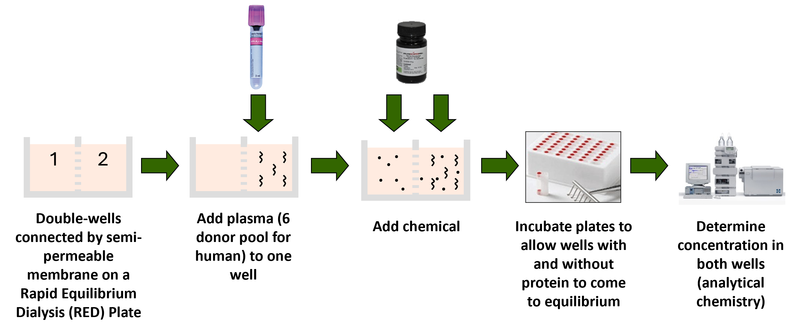

```{r, include = FALSE}
knitr::opts_chunk$set(
  collapse = TRUE
)
```

## Introduction 

This vignette guides users on how to estimate fraction unbound in plasma (f~up~) from mass spectrometry data using rapid equilibrium dialysis (RED). Fraction unbound in plasma is a chemical specific parameter that describes the amount of free chemical in the plasma that is usually responsible for pharmacological effects (Waters et al. 2008).

The mass spectrometry data should be collected from an assay that uses rapid equilibrium dialysis as seen in Figure 1 (Waters et al. 2008). 

```{r, echo = FALSE, out.width = "100%", fig.cap = "Fig 1: f~up~ RED experimental set up", fig.topcaption = TRUE, fig.align = "center"}

```

### Suggested packages for use with this vignette

```{r setup, message = FALSE, warning = FALSE}
# Primary package
library(invitroTKstats)
# Data manipulation package
library(dplyr)
# Table formatting package 
library(flextable)
```

## Load Data 

First, we load in the example dataset from `invitroTKstats`. 

```{r Load example data}
# Load example fup RED data 
data("fup-red-example")
```

Three datasets are loaded in: `fup_red_L0`, `fup_red_L1`, and `fup_red_L2`. These datasets are f~up~ data at Level 0, 1, and 2 respectively. For the purpose of this vignette, we'll start with `fup_red_L0`, the Level 0 data, to demonstrate the complete pipelining process. 

`fup_red_L0` is the output from the `merge_level0` function which compiles raw lab data from specified Excel files into a singular data frame. The data frame contains exactly one row per sample with information obtained from the mass spectrometer. For more details on curating raw lab data to a singular Level 0 data frame, see "Creating dataguide from raw data vignette". 

The following table displays the first three rows of `fup_red_L0`, our Level 0 data. 

```{r, echo = FALSE, warning = FALSE}
head(fup_red_L0, n = 3) %>% 
  flextable() %>% 
  bg(bg = "#DDDDDD", part = "header") %>% 
  autofit() %>% 
  set_table_properties(
    opts_html = list(
      scroll = list(
        
      )
    )
  ) %>% 
  set_caption(caption = "Table 1: Level 0 data", 
              align_with_table = FALSE) %>% 
  fontsize(size = 10, part = "all") %>% 
  theme_vanilla()
```

## Level 1 processing 

`format_fup_red` is the Level 1 function used to create a standardized data frame. This level of processing is necessary because naming conventions or formatting can differ across data sets. 

If the Level 0 data already contains the required column, then the existing column name can be specified. For example, `fup_red_L0` already contains a column specifying the sample name called "Sample". However, the default column name for sample name is "Lab.Sample.Name". Therefore, we specify the correct column with `sample.col = "Sample"`. In general, to specify an already existing column that differs from the default, the user must use the parameter with the `.col` suffix. 

If the Level 0 data does not already contain the required column, then the entire column can be populated with a single value. For example, `fup_red_L0` does not contain a column specifying biological replicates. Therefore, we populate the required column with `biological.replicates = 1`. In general, to specify a single value for an entire column, the user must use the parameter without the `.col` suffix. 

Users should be mindful if they choose to specify a single value for all of their samples and verify that that is the action they wish to take. 

Some columns must be present in the Level 0 data while others can be filled with a single value. At minimum, the following columns must be present in the Level 0 data and specification with a single entry is not permitted: `sample.col`, `compound.col`, `dtxsid.col`, `lab.compound.col`, `type.col`, `istd.col`, `area.col`, and `note.col`. 

The rest of the following columns may either be specified from the Level 0 data or filled with a single value: `date.col` or `date`, `cal.col` or `cal`, `dilution.col` or `dilution`, `time.col` or `time`, `istd.name.col` or `istd.name`, `istd.conc.col` or `istd.conc`, `test.nominal.conc.col` or `test.nominal.conc`, `plasma.percent.col` or `plasma.percent`, `test.conc.col` or `test.conc`, `biological.replicates.col` or `biological.replicates`, `technical.replicates.col` or `technical.replicates`, `analysis.method.col` or `analysis.method`, `analysis.instrument.col` or `analysis.instrument`, `analysis.parameters.col` or `analysis.parameters`, `level0.file.col` or `level0.file`, and `level0.sheet.col` or `level0.sheet`. 

```{r required cols, echo = FALSE}
# Create table of required arguments for Level 1 

req_cols <- data.frame(matrix(nrow = 31, ncol = 5))
vars <- c("Argument", "Default", "Required in L0?", "Corresp. single-entry Argument", "Descr.")
colnames(req_cols) <- vars

# Argument names 
arguments <- c("FILENAME", "data.in", "sample.col", "date.col", "compound.col", "dtxsid.col", 
               "lab.compound.col", "type.col", "cal.col", "dilution.col", "time.col", 
               "istd.col", "istd.name.col", "istd.conc.col", "test.nominal.conc.col", 
               "plasma.percent.col", "test.conc.col", "area.col",
               "biological.replicates.col", "technical.replicates.col",
               "analysis.method.col", "analysis.instrument.col", 
               "analysis.parameters.col", "note.col", "level0.file.col", 
               "level0.sheet.col", "output.res", "save.bad.types", "sig.figs", 
               "INPUT.DIR", "OUTPUT.DIR")
req_cols[,"Argument"] <- arguments 

# Default arguments 
defaults <- c("MYDATA", NA, "Lab.Sample.Name", "Date", "Compound.Name", "DTXSID",
              "Lab.Compound.Name", "Sample.Type", "Cal", "Dilution.Factor", 
              "Time", "ISTD.Area", "ISTD.Name", "ISTD.Conc", "Test.Target.Conc", 
              "Plasma.Percent", "Test.Compound.Conc", "Area", "Biological.Replicates", 
              "Technical.Replicates", "Analysis.Method", "Analysis.Instrument", 
              "Analysis.Parameters", "Note", "Level0.File", "Level0.Sheet", 
              TRUE, FALSE, 5, NA, NA)
req_cols[,"Default"] <- defaults

# Argument required in L0? 
req_cols <- req_cols %>% 
  mutate("Required in L0?" = case_when(
    Argument %in% c("sample.col", "compound.col", "dtxsid.col", "lab.compound.col", 
                    "type.col", "istd.col", "area.col", "note.col") ~ "Y",
    Argument %in% c("FILENAME", "data.in", "output.res", "save.bad.types", "sig.figs", 
                    "INPUT.DIR", "OUTPUT.DIR") ~ "N/A",
    .default = "N"
  ))

# Corresponding single-entry Argument 
req_cols <- req_cols %>% 
  mutate("Corresp. single-entry Argument" = ifelse(.data[[vars[3]]] == "N",
                                                   gsub(".col", "", Argument), NA))

# Brief description 
description <- c("Output and input filename",
                 "Level 0 data frame", 
                 "Lab sample name", 
                 "Lab measurement date", 
                 "Formal test compound name", 
                 "EPA's DSSTox Structure ID", 
                 "Lab test compound name (abbr.)", 
                 "Sample type (Blank/Plasma/PBS/T0/Stability/EC1/EC2/CC)",
                 "MS calibration", 
                 "Number of times sample was diluted",
                 "Incubation time", 
                 "Internal standard peak area", 
                 "Internal standard name", 
                 "Internal standard concentration", 
                 "Initial chemical concentration",
                 "% of the physiological plasma concentration",
                 "Standard test chemical concentration",
                 "Target analyte peak area", 
                 "Replicates with the same analyte", 
                 "Repeated measurements from one sample",
                 "Analytical chemistry analysis method",
                 "Analytical chemistry analysis instrument", 
                 "Analytical chemistry analysis parameters", 
                 "Additional notes", 
                 "Raw data filename", 
                 "Raw data sheet name", 
                 "Export results (TSV)?",
                 "Export bad data (TSV)?",
                 "Number of sig figs", 
                 "Input directory of Level 0 file", 
                 "Export directory to save Level 1 files")
req_cols[,"Descr."] <- description
```

```{r, echo = FALSE, warning = FALSE}
req_cols %>% 
  flextable() %>% 
  bg(bg = "#DDDDDD", part = "header") %>% 
  autofit() %>% 
  set_table_properties(
    opts_html = list(
      scroll = list(
        height = 200
      )
    )
  ) %>% 
  set_caption(caption = "Table 2: Level 1 `format_fup_red` function arguments", align_with_table = FALSE) %>% 
  fontsize(size = 10, part = "all") %>% 
  theme_vanilla()
```

By default, a TSV file containing the Level 1 data is exported to the user's directory. We have omitted this export with `output.res = FALSE`. The option to omit exporting a TSV file is also available at Levels 2 and 3 and will be used from this point forward. 

```{r L1 processing}
fup_red_L1_curated <- format_fup_red(FILENAME = "Fup_RED_vignette",
                                     data.in = fup_red_L0, 
                                     # columns present in L0 data 
                                     sample.col = "Sample",
                                     compound.col = "Compound", 
                                     lab.compound.col = "Lab.Compound.ID",
                                     istd.col = "ISTD.Peak.Area", 
                                     test.conc.col = "Compound.Conc",
                                     area.col = "Peak.Area",
                                     note.col = "Sample Text", 
                                     # columns not present in L0 data
                                     cal = 1, 
                                     istd.conc = 0.01, 
                                     test.nominal.conc = 10,
                                     plasma.percent = 100,
                                     biological.replicates = 1,
                                     analysis.method = "LCMS",
                                     analysis.instrument = "Waters ACQUITY I-Class UHPLC - Xevo TQ-S uTQMS",
                                     analysis.parameters = "RT",
                                     # don't export output TSV file 
                                     output.res = FALSE,
                                     save.bad.types = TRUE
                                     )
                                 
```

We receive a warning message that some of our samples have been removed due to "inappropriate sample types". The removed samples include data that did not have one of the following sample types 

1. Blank with plasma (Plasma.Blank)
3. Blank without plasma (NoPlasma.Blank)
2. Plasma well concentration (Plasma)
3. Phosphate-buffered well concentration (PBS)
4. Time zero plasma concentration (T0)
5. Plasma stability sample (Stability)
6. Equilibrium Control Well 1 (EQ1)
7. Equilibrium Control Well 2 (EQ2)
8. Calibration Curve (CC)

The following table displays some of the samples that were removed. 

```{r}
fup_red_L0 %>% 
  filter(!Sample.Type %in% c("Plasma", "PBS", "T0", "Plasma.Blank", "NoPlasma.Blank","CC", "Stability", "EQ1", "EQ2"))

fup_red_L1 %>% 
  distinct(Sample.Type)
```


## References 

Waters, N. J., Jones, R., Williams, G., & Sohal, B. (2008). Validation of a rapid equilibrium dialysis approach for the measurement of plasma protein binding. Journal of pharmaceutical sciences, 97(10), 4586-4595.
