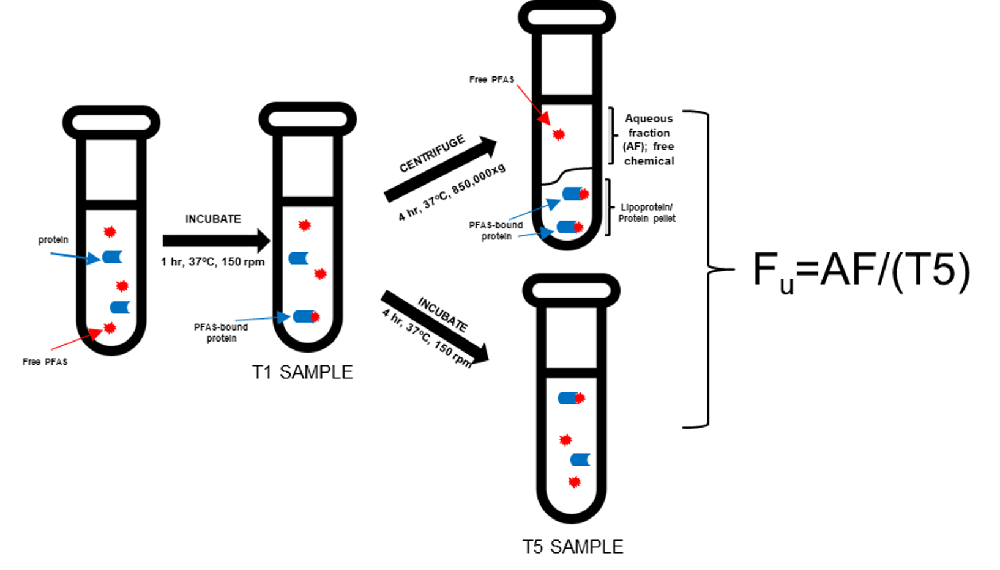

```{r, include = FALSE}
knitr::opts_chunk$set(
  collapse = TRUE
)
```


## Introduction 

This vignette guides users on how to estimate fraction unbound in plasma (f~up~) from mass spectrometry data using ultracentrifugation (UC). Fraction unbound in plasma is a chemical specific parameter that describes the amount of free chemical in the plasma that is usually responsible for pharmacological effects (Redgrave et al. 1975). 

The mass spectrometry data should be collected from an assay that uses ultracentrifugation as seen in Figure 1 (Smeltz et al. 2023, Kreutz et al. 2023). 

```{r, echo = FALSE, out.width = 100%, fig.cap = "Fig 1: f~up~ UC experimental set up", fig.topcaption = TRUE, fig.align = "center"}

```

### Suggested packages for use with this vignette 

```{r setup, message = FALSE, warning = FALSE}
# Primary package 
library(invitroTKstats)
# Data manipulation package 
library(dplyr)
# Table formatting package 
library(flextable)
```

## Load Data

First, we load in the example dataset from `invitroTKstats`. 

```{r Load example data}
# Load example fup UC data 
data("Fup-UC-example")
```

Three datasets are loaded in: `fup_uc_L0`, `fup_uc_L1`, and `fup_uc_L2`. These datasets are f~up~ data at Level 0, 1, and 2 respectively. For the purpose of this vignette, we'll start with `fup_uc_L0`, the Level 0 data, to demonstrate the complete pipelining process. 

`fup_uc_L0` is the output from the `merge_level0` function which compiles raw lab data from specified Excel files into a singular data frame. The data frame contains exactly one row per sample with information obtained from the mass spectrometer. For more details on curating raw lab data to a singular Level 0 data frame, see "Creating dataguide from raw data vignette". 

The following table displays the first three rows of `fup_uc_L0`, our Level 0 data. 

```{r, echo = FALSE, warning = FALSE}
head(fup_uc_L0, n = 3) %>% 
  flextable() %>% 
  bg(bg = "#DDDDDD", part = "header") %>% 
  autofit() %>% 
  set_table_properties(
    opts_html = list(
      scroll = list(
        
      )
    )
  ) %>% 
  set_caption(caption = "Table 1: Level 0 data", 
              align_with_table = FALSE) %>% 
  fontsize(size = 10, part = "all") %>% 
  theme_vanilla()
```

## Level 1 processing 

`format_fup_uc` is the Level 1 function used to create a standardized data frame. This level of processing is necessary because naming conventions or formatting can differ across data sets. 

If the Level 0 data already contains the required column, then the existing column name can be specified. For example, `fup_uc_L0` already contains a column specifying the sample name called "Sample". However, the default column name for sample name is "Lab.Sample.Name". Therefore, we specify the correct column with `sample.col = "Sample"`. In general, to specify an already existing column that differs from the default, the user must use the parameter with the `.col` suffix. 

If the Level 0 data does not already contain the required column, then the entire column can be populated with a single value. For example, `fup_uc_L0` does not contain a column specifying biological replicates. Therefore, we populate the required column with `biological.replicates = 1`. In general, to specify a single value for an entire column, the user must use the parameter without the `.col` suffix. 

Users should be mindful if they choose to specify a single value for all of their samples and verify that that is the action they wish to take. 

Some columns must be present in the Level 0 data while others can be filled with a single value. 

```{r required cols, echo = FALSE}
# Create table of required arguments for Level 1 

req_cols <- data.frame(matrix(nrow = 28, ncol = 5))
vars <- c("Argument", "Default", "Required in L0?", "Corresp. single-entry Argument", "Descr.")
colnames(req_cols) <- vars

# Argument names 
arguments <- c("FILENAME", "data.in", "sample.col", "lab.compound.col", "dtxsid.col", 
               "date.col", "compound.col", "area.col", "type.col", "test.conc.col", 
               "cal.col", "dilution.col", "istd.col", "istd.name.col", "istd.conc.col", 
               "uc.assay.conc.col", "biological.replicates.col",
               "technical.replicates.col", "analysis.method.col", 
               "analysis.instrument.col", "analysis.parameters.col", "note.col", 
               "level0.file.col", "level0.sheet.col", "output.res", "save.bad.types",
               "INPUT.DIR", "OUTPUT.DIR"
               )
req_cols[, "Argument"] <- arguments 

# Default arguments 
defaults <- c("MYDATA", NA, "Lab.Sample.Name", "Lab.Compound.Name", "DTXSID", 
              "Date", "Compound.Name", "Area", "Sample.Type", "Test.Compound.Conc", 
              "Cal", "Dilution.Factor", "ISTD.Area", "ISTD.Name", "ISTD.Conc", 
              "UC.Assay.Conc", "Biological.Replicates", "Technical.Replicates", 
              "Analysis.Method", "Analysis.Instrument", "Analysis.Parameters", 
              "Note", "Level0.File", "Level0.Sheet", TRUE, FALSE, NA, NA)
req_cols[, "Default"] <- defaults 

req_cols
```


## References 

Kreutz, A., Clifton, M. S., Henderson, W. M., Smeltz, M. G., Phillips, M., Wambaugh, J. F., & Wetmore, B. A. (2023). Category-based toxicokinetic evaluations of data-poor per-and polyfluoroalkyl substances (PFAS) using gas chromatography coupled with mass spectrometry. Toxics, 11(5), 463.

Redgrave, T. G., Roberts, D. C. K., & West, C. E. (1975). Separation of plasma lipoproteins by density-gradient ultracentrifugation. Analytical biochemistry, 65(1-2), 42-49.

Smeltz, M., Wambaugh, J. F., & Wetmore, B. A. (2023). Plasma protein binding evaluations of per-and polyfluoroalkyl substances for category-based toxicokinetic assessment. Chemical research in toxicology, 36(6), 870-881.
